*All prices for this list will be in Australian Dollars.*

This is a series started by Sam Bowman that I stumbled across a little while ago, and I thought I’d throw my hat in the ring. These are some of the things I’ve bought and found to be extremely useful and immensely enjoyable. In keeping with the theme of the previous entries in this series, I’ve tried to be as budget friendly as possible, but I’ve also attached some links to the more expensive things that I thoroughly enjoy at the bottom of this article. For the other entries in this list, see the links below.

- - -

1. [**Sam Bowman’s original post**](https://s8mb.medium.com/stuff-that-i-recommend-you-buy-747d7a3bd51e)

2. [**Sam’s second post**](https://s8mb.medium.com/things-i-recommend-you-buy-and-use-second-edition-457a8e7163f6)

3. [**Robert Wiblin of 80,000 hours responds to Sam’s post**](https://medium.com/@robertwiblin/things-i-recommend-you-buy-and-use-rob-edition-1d7b2ce27d68)

4. [**Sam Bowman’s updated list for 2020**](https://www.sambowman.co/p/things-i-recommend-you-buy-2020-sam-bowman)

5. [**Sam Bowman’s 2023 list**](https://www.sambowman.co/p/things-i-recommend-you-buy-and-use)

6. [**Sam Enright’s list, inspired by Bowman’s 2023 list.**](https://reasonalone.substack.com/p/things-i-recommend-you-buy-and-use)

- - -

# Kitchen
### [Cheap knife set](https://www.kmart.com.au/product/6-piece-stainless-steel-knife-block-set-43328291/?) — $25

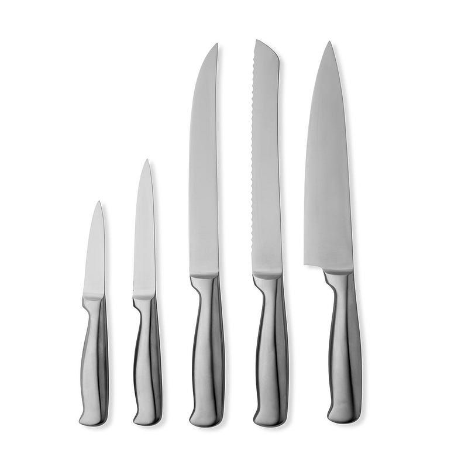

There’s certainly some enjoyment that can be derived from owning fancy hardened steel knives, and if you cook a lot then they’re certainly worth the investment. However, a cheap 5-piece knife set will work *just fine* for most normal home use. There’s no need to follow specific care instructions for these things, they can go straight in the dishwasher without  any fear of damage,  and they do all that needs to be done for pretty much all home cooking. In fact, I’d go so far as to say that one only needs **three knives**: a general-purpose chef’s knife for most chopping tasks, a bread knife for, well, bread, and a paring knife for small precise work. I bought this cheap  set from my local Kmart, and I’ve had no complaints with them thus far. There’s probably some similar sets for similar prices at your local Target or home goods store.

### [Pull through knife sharpener](https://www.amazon.com.au/Wiltshire-Stage-Sharpener-Knife-41322/dp/B07HXPVYSG) — $24

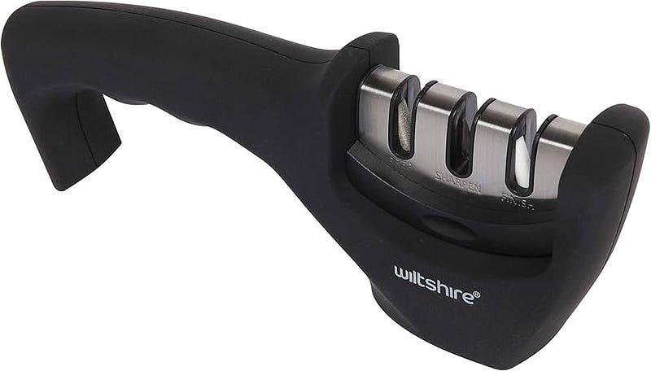

If you listen to chefs of any kind online for any amount of time, you’ll have undoubtedly been told to use a whetstone of some kind for sharpening your knives. While that is undoubtedly the best way of doing it, it’s also the most arduous and fiddly way of doing it, and developing the skills required for good whetstone sharpening requires much more time than one often has free to dedicate to that kind of thing. Whetstone sharpening is also more relevant to harder, more expensive knives, and doesn't make too much sense for cheaper, softer knives (like those above).

Enter the pull-through knife sharpener. It’s a wonderful accompaniment for a cheap knife set, as it requires minimal effort and knowledge to use properly. As most cheap knives are made from soft metals like stainless steel, a pull-through knife sharpener is more than adequate for sharpening. There are versions of these sharpeners that have adjustable angles, but in my experience, they’re not really worth it. I have this exact one at home and use it on all my cheap knives. It sharpens them beautifully, and I make sure that I run my knives through the ceramic “finishing” side before I cook dinner to hone the edge.

### [Kitchen shears](https://www.amazon.com.au/OXO-1072121-Kitchen-Scissors-Stainless/dp/B000KILLXM/ref=mp_s_a_1_3?crid=1EICVN1116K03&dib=eyJ2IjoiMSJ9.DlnkdB0pUJOidsxYUzAo_QsbDzQ7cTbwYlMESl9tbz-6f717lb9Y0_i2cgsPdhNurakJiDELHqekScbVCv6bBlgbCFnHzdp7d-_OcjK3d4YbWn5Eosm1f8UgAfGWXxoEzpjGpfTihITw7JTFGlWSMPj5mgA17PFsZUMpwD4Gq3CN_gIT734pRrUILiCtQFOiXie2djRIaS706JIwcLgsVg.soEl4acZ3U_PxoCRiAhoJVSQDAFfSoN_vdlZO3CQmUs&dib_tag=se&keywords=kitchen+shears&qid=1724113797&sprefix=kitchen+shears%2Caps%2C578&sr=8-3) — $50

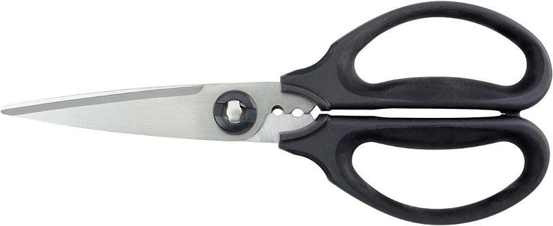

This is something I actually recommend you don’t cheap out on. A good set of kitchen shears is a worthwhile investment, and they can last you a while. They’re really good for all kinds of tasks, but are especially good for working with small cuts of meat or chopping a salad in a a bowl. The ones I’ve linked here are dishwasher safe, easy to disassemble for easy cleaning, and have two little holes near the handles to strip herbs, if you’re that kind of person. I bought a set of these a while back, and they’ve lasted well and retained their edge. They also can be run through a knife sharpener like the one above (which is what I do), but these might be worth learning how to use a whetstone for.

# Software and Services
### [Barcodes](https://smallcolossus.com/apps/barcodes) — $15 (sorry android people)

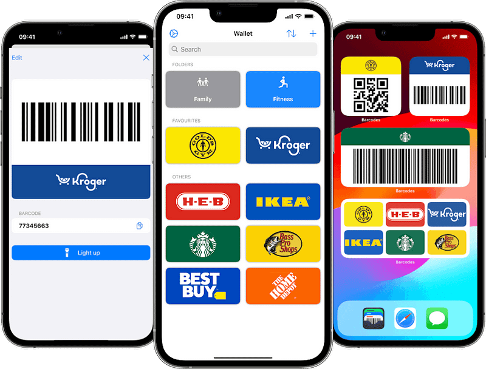

This is **the best** loyalty card app I’ve ever used. I was previously using Stocard (an app I have come to detest so much that I won’t do it the dignity of being linked here), and discovering this has been a *very* welcome change. You simply scan the barcode of the loyalty card with the camera or import it from a photo, and the app will find the store colours and iconography and apply those to the card. If it’s not the right information, you can search for the store manually when editing the card, or you can use a custom icon and colour instead. If you can’t find the information for the card you have, the developer has linked a form which you can use to submit the correct information. This app gets regular updates and improvements, doesn’t collect your data (unlike Stocard), and has made my wallet lighter and my life easier. I can’t recommend this enough.

  

### [Todoist](https://todoist.com/) — from $0

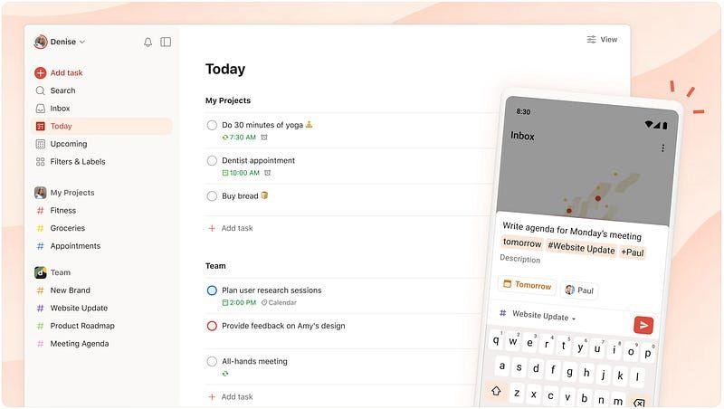

This is one of those rare apps in the notetaking/organisation space that I actually use. Notion has been hit or miss for me, Things didn’t work in my cross-platform computing life, and every other piece of specialty software has been a bust. All except Todoist. I started using their free version in 2020 and I’ve never looked back. What you get on the free plan is fairly barebones: 5 projects only (not counting archived ones), no reminders, and no calendar layout. Everything else is included though, and that’s been more than enough for me. I really love how snappy the app feels on any platform (except for the windows desktop version which is just an Electron app — I have certain opinions about that), I love their lock screen widget in iOS that lets you add a task immediately, and I absolutely adore their natural language date and time input. It’s been a game-changer for organising my life, projects, and assignments, and I encourage anyone who struggles with organisation to give the free plan a try.

### [Pocket Casts](https://pocketcasts.com/) — from $0

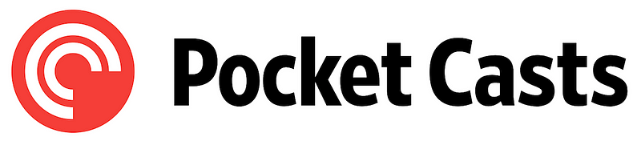

I first discovered pocket casts when I moved on from my beloved iPhone SE 1st Gen and onto a Samsung Galaxy S21. I decided at that point that I wanted to try listing to podcasts, and so I used Spotify, which I was already paying for. However, Spotify’s podcast interface was (and frankly still is) truly horrible, and I decided to look for something better. I switched over to Pocket Casts and became enamoured instantly. It has everything that I want in a podcast player for free: auto-skipping, smart silence trimming (which is really impressive by the way), voice volume boosting, and automatic rule-based podcast organisation. I’ve become very nerdy about these things, but you really don’t have to be like that to enjoy this app. If you currently listen to podcasts on Spotify, then please be kind to yourself and switch to Pocket Casts. If you don’t currently listen to podcasts, I encourage you to give it a try with this app.

### A good 2FA app — from $0

There’s nothing suggested in the title here because of the sheer volume of 2FA apps that exist. It’s worth finding one that works for you, especially with the increase of data breaches over the years.

For those unaware, a 2FA app is much better for security than being sent a code through a text message or email because it relies on a **web communication standard** and not a **digital identifier.** Using a phone number or email for 2FA is risky, because if either of those identifiers get leaked in a [data breach](https://www.theverge.com/2024/8/16/24222112/data-breach-national-public-data-2-9-billion-ssn), your main method of security is now accessible to bad actors, who ***can and will*** compromise your accounts and use them for their personal gain. It’s happened to me and to my parents, though thankfully none of our data was stolen or deleted before we became aware of the issue. A 2FA app bypasses this issue by avoiding the need for an identifier in the first place, instead using web technologies and encryption to deliver a randomised code to an app on your phone that you have to manually input to continue the login process. It may be more effort, but it’s worth the additional protection that it offers.

There’s loads of 2FA apps out there, but only a few I recommend. I’ve made a short list of some good ones, so make sure you pick one of these and set up 2FA for [everything that allows it](https://2fa.directory/int/).

- [Ente Auth](https://ente.io/auth/) (cross-platform, free, and my most recommended)
- [2FAS](https://2fas.com/) (cross-platform, free)
- [Microsoft Authenticator](https://www.microsoft.com/en-au/security/mobile-authenticator-app) (cross-platform, free)
- Google Authenticator - [iOS](https://apps.apple.com/au/app/google-authenticator/id388497605) - [Android](https://play.google.com/store/apps/details?id=com.google.android.apps.authenticator2&hl=en_AU) (cross-platform, free)
- [Step Two](https://steptwo.app/) (Apple only, free for 10 accounts then a one-time purchase)
- [Authenticator Pro](https://play.google.com/store/apps/details?id=me.jmh.authenticatorpro&hl=en_AU) (Android only, free)

# Personal items
### Some damn good socks — from $12

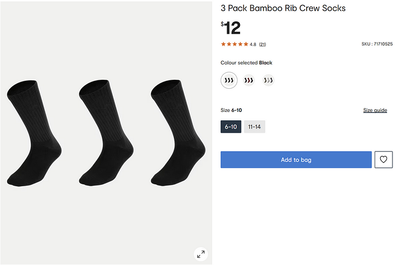

The only brand I’ve heard to be fairly universally appreciated is [Bombas](https://shop.bombas.com/), but they’re not available in Australia, so I’ve had to make do. Ultimately, socks are quite subjective, and it’s a good idea to shop around if you can. I’ve paid top dollar for some of the crappiest, scratchiest excuses for socks from designer brands, and paid pennies at big box stores for some really good pairs. My preferred socks are these [bamboo socks from my local Kmart](https://www.kmart.com.au/product/3-pack-bamboo-rib-crew-socks-s158962/?selectedSwatch=Black). They’re only $12 for a three-pack, and they’re the most comfortable socks I’ve ever worn. I make an effort to get another pack whenever I go shopping out of fear that they’ll stop making them one day. I have so many socks.

### Cetaphil [Daily Facial Cleanser](https://www.amazon.com.au/Cetaphil-Dermatologist-Non-irritating-Formulated-Niacinamide/dp/B0CY1FM12B?ref_=ast_sto_dp) and [Exfoliant](https://www.amazon.com.au/Cetaphil-Daily-Exfoliating-Cleanser-178/dp/B07ZGCRQ1N?ref_=ast_sto_dp) — $17 and $20, respectively

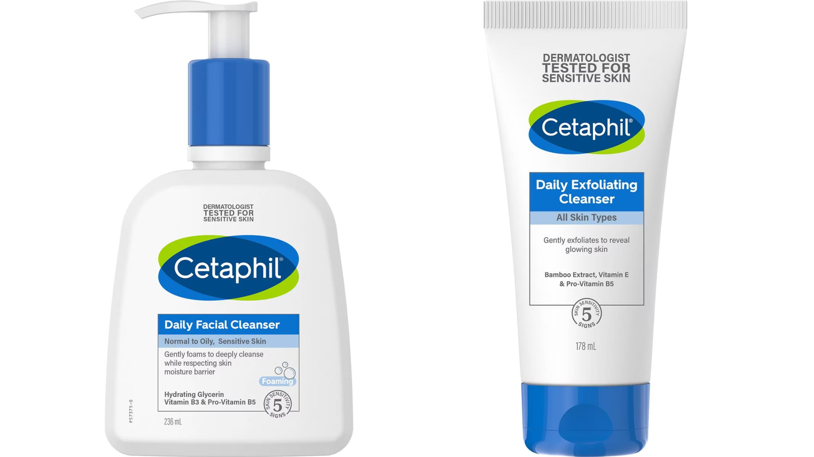

These are a package deal for me. I use them both daily (as the name may imply) and my skin has never felt better. I’ve used all kinds of designer creams and exfoliants and scrubs and oils and what have you, but these two bottles of goop (along with a [moisturiser from Olay](https://www.amazon.com.au/Olay-Complete-Protection-Moisture-Sensitive/dp/B07H7Y461V/ref=mp_s_a_1_8?crid=2TMGY52Z5VHMM&dib=eyJ2IjoiMSJ9.eNQpnZwWjyQ7Ws0DIs6tOQY9l3kWIosN29SZy2xjlOVSeWoukO8UUhhKcRVw6pzpaUxGX2RneM7Nnf13D7K5GqLM-Hh6zmfERGtaJ8oVxbMDFW7HID6U6Y8yq8XF4av7uTED8cH_9FoVPguhls3HCI1F-s7Dlubu6cxDpw0iLu4eQHYPp4LHW1XT9oGQFUEsyVfmxQfDKXE-lcT92u7LJQ.c2uSUq2undtlRrJzRnxp4B2aLqCTH3O7RfHjlG74mQk&dib_tag=se&keywords=olay+moisturising+cream&qid=1724158259&sprefix=olay+%2Caps%2C503&sr=8-8)) have done more for my skin than any fancy products ever have. They feel amazing, and work really well to get dirt out of my pores after I’ve been outside surveying all day without making my skin feel tight and dry like other products have. They’re really good for anyone who’s tried everything or at least is thinking about it. Pick up that moisturiser while you’re at it too — it’s the only one I’ve found that doesn’t ruin my glasses with smudges and grease, and it works amazingly to boot.

# Everyday utilities
### [Orbitkey key organiser](https://www.amazon.com.au/Orbitkey-Leather-Organizer-Chestnut-Stitching/dp/B08383V5B3?ref_=ast_sto_dp&th=1) (or similar) — $50

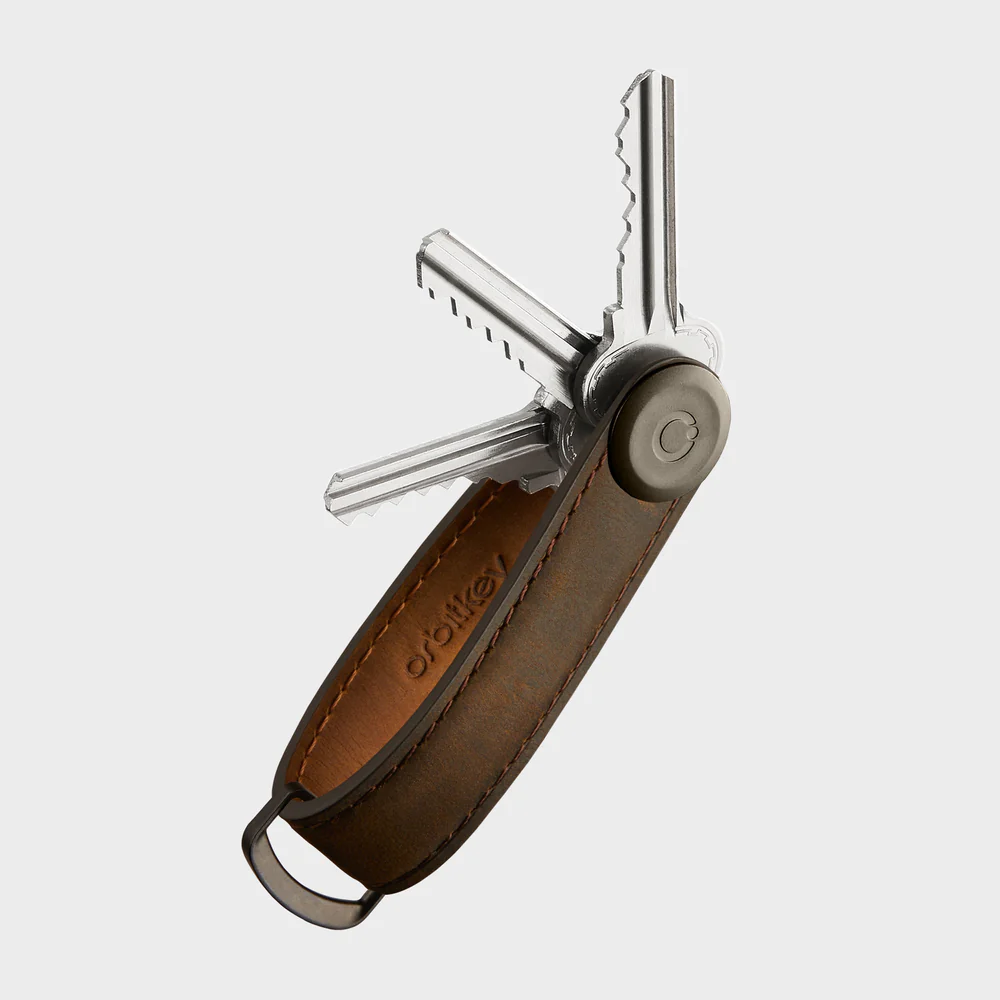

I bought this exact key organiser in 2022, and it’s made my life noticeably better. Having all my keys on one place and in order has been really helpful for organisation, and it’s easy to detach this from my larger set of car keys when I want to go on a walk or ride my bike and don’t need the extra bulk of all the various attachments that one collects just by having a set of keys. It’s certainly not as easy to add a key to this as it is to a split ring or carabiner, but the utility of having everything in one place far outweighs the ease of those other options. I got the “Crazy Horse” variation as I love the natural leather look, and the patina it developed is frankly beautiful.

### [Rubber cable clips](https://www.amazon.com/OHill-Organizer-Management-Organizing-Adhesive/dp/B071FXZBMV/ref=sr_1_3?crid=NLW3WLD3XGX0&dib=eyJ2IjoiMSJ9.R9-GM50-vceAXYUyK8ugFhvrPZLMN_CaSyMQzW4_kfJRCvBlMWnrzQipkdARh1kf2n4wtp0QdpAvudiazFE0EBuAz44cRxcZTA6ZCXhkmBo8MpnUSQqYXQkQwYLWV2TLhes0KLO3groeYmr7gtO3v2_bZVPa2LF2FFyxdfuavg2my-nqwxqvGBcRuqX4BHy0-lBkNy1qy4n3XK6xjsEuvDYIj18mcqLMwzyXVFXhAf0.u3dcysXPfAjVzl0HE6tXyDP8-qaDx--bVRT9w14r_Rw&dib_tag=se&keywords=cable+holder+for+desk&qid=1722748564&sprefix=cable+holder+for+des%2Caps%2C296&sr=8-3) — from $13

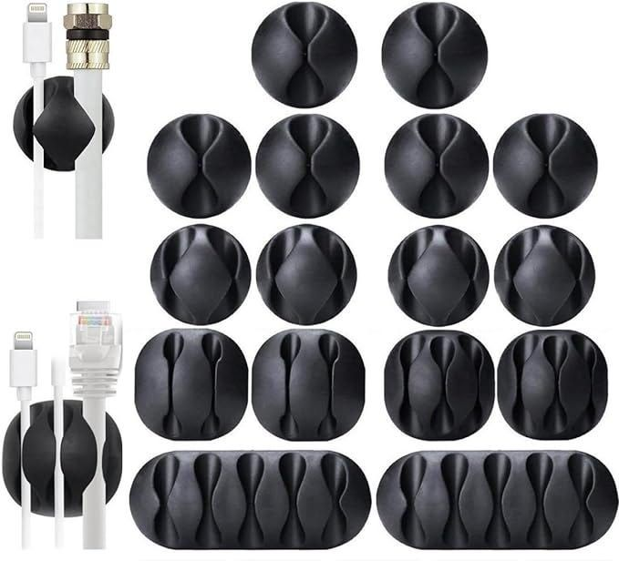

While I don’t have these exact cable clips, I can nonetheless recommend them. These things are awesome — you can stick them pretty much anywhere with their double-sided-tape backing, and they just hold your cables. They’re great for keeping cables up off the floor, or in my case, holding my iPhone and Apple Watch cables on the side of my desk so I can easily grab them as needed. They’re fairly cheap, and you can probably find these or similar ones at your local stationery store.

### [Velcro cable ties](https://www.amazon.com/VELCRO-Brand-Cable-Ties-100Pk/dp/B001E1Y5O6/ref=sr_1_4?crid=3DSGVFSKTZJYZ&dib=eyJ2IjoiMSJ9.3RCWpBR9nnPUY0kQZTZPfKou4ICya2PMhZEpIuMbCa3zj9AFxNS8Kv7lyVvtz8xht3qRv4V4fZkx9Lg4MRfNp-ce_LXL1Nv0TCCH_vxujlPL5HabSpRZui6O9Ghdjkb-2FnUj-wZWMr0klDWAMZRBVA7IUVobYBglWZH80vL6EO_EmV3c24rLF_gHJISG-I2L5lbqcZwwYD7RShJqhScTY0Aiv69bBvcmmt4_fWHiEI.IJG6rHchezm06T6BF9oS3eN4uynIkGUzBAUxsnltw3E&dib_tag=se&keywords=velcro%2Bcable%2Bties&qid=1722860190&sprefix=velcro%2Bcable%2Btie%2Caps%2C359&sr=8-4&th=1) — ~$17

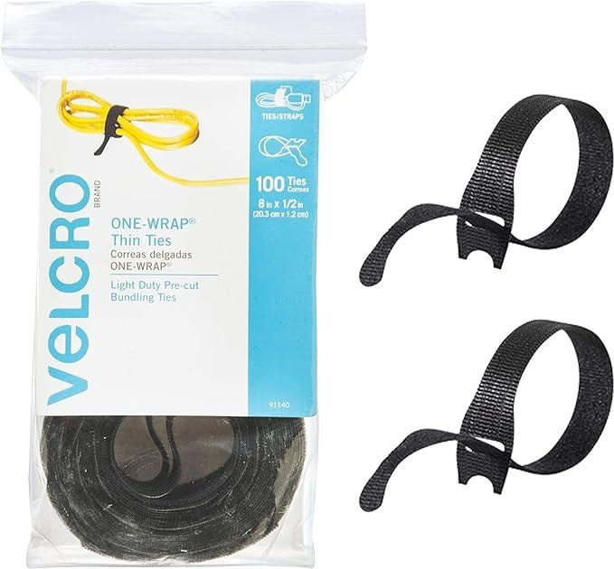

On the topic of cables, I have the unfortunate habit of collecting all the cables from all my devices, storing them in a drawer,  and never throwing them away because *one day I just might need that one particular cable.* Rather than changing my ways and dealing with the habit itself, I purchased these reusable cable ties so the rat’s nest created by my cable hoard is at least somewhat orderly. I’m only halfway though the 100-pack that I bought, and I’ve used them everywhere and for everything. They tie up the cables in my desk setup, they bundle my charging cables when I travel and they hold all the cables inside my PC together. If there’s a cable in my house, it will most likely have one of these cable ties on it. I love them.

### [Electric candle lighter](https://www.amazon.com/Electric-Lighter%EF%BC%8CUSB-Charge%EF%BC%8CRechargeable%EF%BC%8CArc%EF%BC%8CPlasma-Candles%EF%BC%8CFireworks%EF%BC%8CGrill%EF%BC%8CCook-Obsidian/dp/B08GLRLH25/ref=sr_1_5?crid=2XWA0L0GV03PZ&dib=eyJ2IjoiMSJ9.t-_MoTSHoDMvJHfTVxOy2rM46WfghkoRLLvKto7P0yyT-9nBUjTDU-OAgPus_SFBMntDnW55xqeleZzj8LoKSK6mSuCqFvhVd_945ZPOHj5ppUBzHUqMpdMg9Mwpcvh7MfARKpA-zFw7hsbcKlbuerjtTMErQYLtVIFLCK8MYQWL8bbsgLqCYkjTqx3ql0tlGOfNoOtTxsfjnB7A4Zif2EJ83uER8UZUgJUwsV5nK-EsDqD3Bw7PBG8qtVsbF7jrURVh0Qyv813_qSMMk92pltFjyMD0mmw4pKhnyI8dxZg.QCN0QAyHvlUiC9nfhk8JJdGye0b-2MnLTJm3dOD3gbg&dib_tag=se&keywords=electric%2Barc%2Blighter&qid=1722749159&sprefix=electric%2Barc%2Blight%2Caps%2C356&sr=8-5&th=1) — $11

  

I don’t like matches, mainly because I don’t like how needlessly wasteful they are. They also feel cumbersome to use, are prone to breaking, and are a hassle to keep alive if you live in a humid area like me. I also didn’t want to buy a gas lighter that I have to spend money to either replace or refill when it runs dry, which is why I moved to using an arc lighter. These things are rechargeable, cost effective, and do all the same jobs that matches and lighters do. I’ve started countless campfires with the one I bought — [a nice $70 metal one from Flint](https://shopflint.co/products/flint-electric-candle-lighter?variant=41716921467036) — and with it, I’ve been able to do away with gas lighters and matches entirely. They’re also better for lighting a grill, as they’re often longer than a traditional lighter or a match.

### [SanDisk Dual Drive Go](https://www.amazon.com/SanDisk-256GB-Ultra-Drive-Type-C/dp/B0D245GQQ1?ref_=ast_sto_dp&th=1) — from ~$20

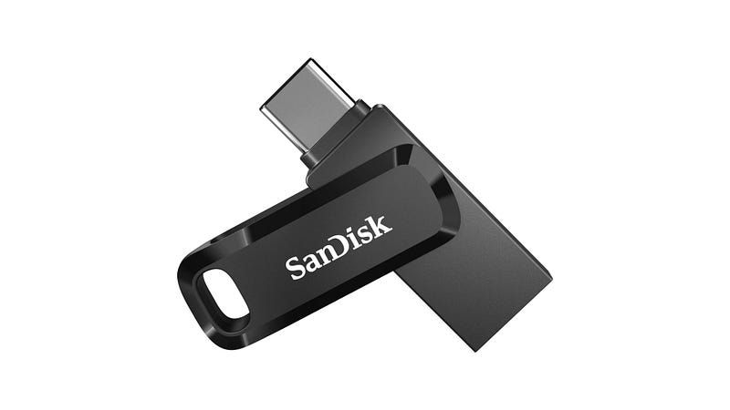

Possibly one of the better purchases I’ve made. I was originally recommended this USB by one of my friends on Threads and now I’m recommending it to everybody, as it’s ridiculously cheap for what you get. What you get is a tiny thumb drive with both USB-A and USB-C connectors, high transfer speeds, and phenomenal capacity. I picked up a 64GB version from my local Officeworks because **it was the cheapest one they had***,* and I use it daily. You can get this thing configured up to 1TB of storage, which is *insane* for something this small.

### [Stanley 5m tape measure](https://www.bunnings.com.au/stanley-5m-19mm-yellow-tape-measure_p0588598) — $9

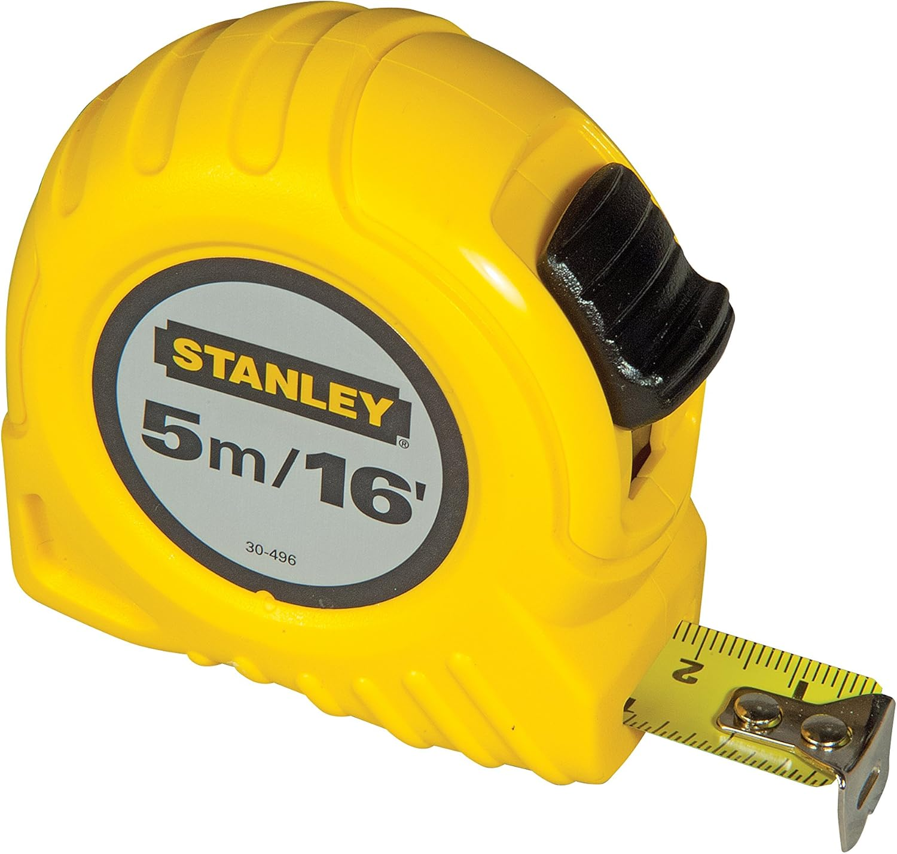

I bought this on a whim at the hardware store one day because it was cheap, thinking that I might find a use for it a some point. It turns out that I need to measure stuff fairly often, so much so that this tape has become part of my everyday carry. It fits in the palm of my hand and is very lightweight, which means I can easily throw it in my bag or even my pocket and completely forget about it until I need it.

The case is a very thick, durable plastic, and the belt clip is pressed steel. The tape itself is only 19mm (about 5/8”) wide with clear graduations, and the spring inside feels sturdy and smooth. It’s very easy to pull and it retracts quickly. The whole thing is also bright yellow, which makes it really easy to find when I inevitably misplace it. The best part is the price. With how cheap this is, I don’t need to worry too much about being rough with it or losing it, as I can pick up another one from whatever hardware store I’m the closest to.

Unfortunately I haven’t been able to find this online for much less than about [$35](https://www.amazon.com.au/Stanley-pocket-tape-16FT-496/dp/B0001GRV8M/ref=mp_s_a_1_19?crid=ILI9RX214DXA&dib=eyJ2IjoiMSJ9.uaY1piVq2Wg76xOHvnt-nc0Jym7tbCwK67QzjpbUKGuudiRIeOzG0Ja7887Pu61jh8JGv24q_wGw4_3QXrYE8vYVnc6SPT3OTYyrWwg0XlBLHq9avD5ZsotN0Za_Y4Fe_c8-cKAaeXGedb0fKorMSXQ0Khn6Jqxc2sMSXoIaO8yj56ZUo2sXYEFABYz3R8ySdnD0_2Nz-_fcs3AmMQPtpA.NSplaaTyVmTMsZB_PsUx1RTctHjbl4wbCxXPxrL_LYQ&dib_tag=se&keywords=stanley+5m+tape+measure&qid=1724112921&sprefix=stanley+5m+%2Caps%2C591&sr=8-19), but this tape in particular should be really easy to find at your local hardware store for very little money.

# Stationery

### [12 pack of Staedtler natural pencils](https://www.amazon.com.au/STAEDTLER-PENCIL-LEAD-NATURAL-BX12/dp/B077H8JX4H/ref=sr_1_30?crid=VV64NIANQN6E&dib=eyJ2IjoiMSJ9.YOw19RZ7fXvrmabQuN5pGmL4tAdnKcmJncr1bloIeKtxFIouMGbZ5UpTIqUWEMGkvCk-ndL07T_TMwopsb0sAbLWZpiEKF_QpFqQe0iEixE-NL8kVkocMSgZIpBX6F7eQjpUQ95hdIQwac6vSnQmIddJVGZhO_ZRKhevKrGvaLvOZvB5qsj6A9UUGFZS6PG9ByH43JSSMPLkGHKQl75SO9Qn-thYLQB1J3uP4GhaOOTz6ahpEM2NbRD0joX_rhBy_AEt7zf8N6QLZPMcR4A_Rr7zltAG3tr6WcGi9BNLxik.Jlz9UfO7EXtwlvpZKW9p36UDxTdD2VwF0HGmAxB2qW8&dib_tag=se&keywords=staedtler+12pk+2b+pencils&qid=1722861953&sprefix=staedlet+12pk+2b+pencil%2Caps%2C245&sr=8-30) — $12

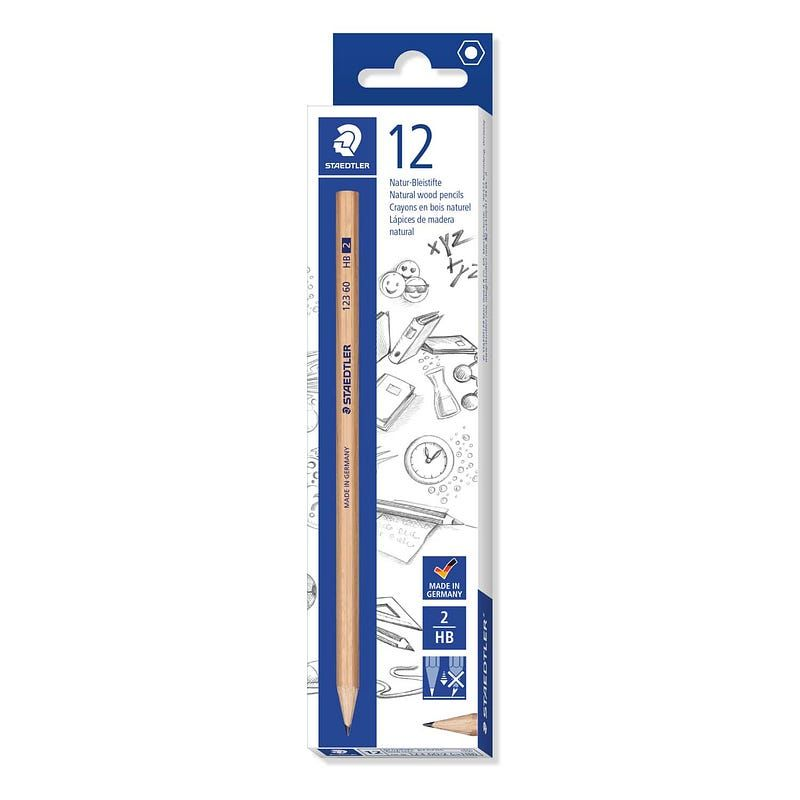

Pencils are one of those things that are just handy to have around. Staedtler has been my go-to brand for a while now, mostly because I love how durable their graphite cores are. I’ve dropped them, stepped on them, thrown them, and accidentally flung them off my desk, and they simply **refuse** to break. I prefer the natural wood ones to the [painted version](https://www.amazon.com.au/Staedtler-Pencils-Tradition-Graphite-110-B/dp/B000SHUQB8/ref=sr_1_21?crid=VV64NIANQN6E&dib=eyJ2IjoiMSJ9.YOw19RZ7fXvrmabQuN5pGmL4tAdnKcmJncr1bloIeKtxFIouMGbZ5UpTIqUWEMGkvCk-ndL07T_TMwopsb0sAbLWZpiEKF_QpFqQe0iEixE-NL8kVkocMSgZIpBX6F7eQjpUQ95hdIQwac6vSnQmIddJVGZhO_ZRKhevKrGvaLvOZvB5qsj6A9UUGFZS6PG9ByH43JSSMPLkGHKQl75SO9Qn-thYLQB1J3uP4GhaOOTz6ahpEM2NbRD0joX_rhBy_AEt7zf8N6QLZPMcR4A_Rr7zltAG3tr6WcGi9BNLxik.Jlz9UfO7EXtwlvpZKW9p36UDxTdD2VwF0HGmAxB2qW8&dib_tag=se&keywords=staedtler%2B12pk%2B2b%2Bpencils&qid=1722862150&sprefix=staedlet%2B12pk%2B2b%2Bpencil%2Caps%2C245&sr=8-21&th=1) because they feel much less slippery and softer to the touch, but you can save about 50c if you go for the painted ones (it all adds up, man).

### [Uni-Ball Jetstream 101 ballpoint pens](https://www.amazon.com.au/Uni-Ball-1768011-Jetstream-Point-12-Count/dp/B003VNGAKC/ref=mp_s_a_1_7?crid=MSKHRSBXZYPI&dib=eyJ2IjoiMSJ9._U44dfTOY0KOE7KRqtw5UtBw8W0uNBCxzCKkwQYjiu1CgCg9LDJBjYu1CzebDp6ckfqFE2sJ3hfuFljjlVcOPbxzfKB0ZOhTOybln6lc1bgZrLr2XC3qV_V54Tv5x9b6V6_o2-epxX6YwrMaEG6-S1cYb-g_mPky3UNPdYxJQgRkjCrGXq-iy8qtguJ4_6Z0Q_xIrCNRerQJjeOoGQGSXw.8MgtB-7Oyvt1AjKZuEv5KSsAHGYdTbnLbnR5rbsKWco&dib_tag=se&keywords=uni%252Bjetstream%252B101%252B0.7&qid=1722863812&sprefix=uni%252Bjetstream%252B101%252B%252Caps%252C357&sr=8%E2%80%937&th=1) — from $2.30

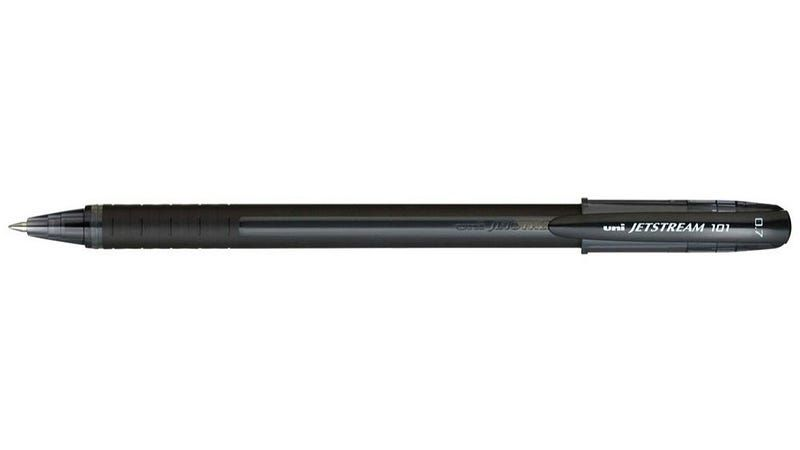

In a similar vein to the pencils, I always keep some of these pens on me. They’re much pricier than your typical [Bic Cristal rollerball](https://www.amazon.com.au/Cristal-Medium-Crystal-Biros-Ballpoint/dp/B004DBHR2Q) (you know the one), but they’re well worth the cost in my eyes. They last for ages, write *incredibly* smoothly, and provide some of the cleanest lines of any pen I’ve used so far (0.7mm is objectively the correct thickness, I will not be taking questions). They also have no moving parts like their [retractable counterpart](https://www.amazon.com.au/Uni-JetStream-101-Retractable-._U44dfTOY0KOE7KRqtw5UtBw8W0uNBCxzCKkwQYjiu1CgCg9LDJBjYu1CzebDp6ckfqFE2sJ3hfuFljjlVcOPbxzfKB0ZOhTOybln6lc1bgZrLr2XC3qV_V54Tv5x9b6V6_o2-epxX6YwrMaEG6-S1cYb-g_mPky3UNPdYxJQgRkjCrGXq-iy8qtguJ4_6Z0Q_xIrCNRerQJjeOoGQGSXw.8MgtB-7Oyvt1AjKZuEv5KSsAHGYdTbnLbnR5rbsKWco&dib_tag=se&keywords=uni+jetstream+101+0.7&qid=1722863812&sprefix=uni+jetstream+101+%252Caps%252C357&sr=8%E2%80%9310-7mm/dp/B09Y8QGN88/ref=mp_s_a_1_1?crid=MSKHRSBXZYPI&dib=eyJ2IjoiMSJ9)s, which I frankly find very appealing from a reliability perspective. They’re $2.30 per pen at my local Officeworks, but I’ve linked to a 12 pack on amazon because it doesn't hurt to have a few spares.

### [Post it notes](https://www.amazon.com.au/Post-Orange-47-6mm-Sheets-2051-FLT/dp/B000GAVJP4/ref=sr_1_5?crid=CZITY5B0T5G2&dib=eyJ2IjoiMSJ9.ikFhjKosDEST__FaMbeKlL5cq5V8OeYHd3fPqDhW0G0CrQNs3t_yjrwyevrBB14OkrEIyLyVpFkPGCnyS7eHYGR3IK6fW6HAmP0_YfHQL7dGWevh2YdNSHUSVvhRw70DU0GlKG1VcmdPg-lnKejuBkrFMTRrUmzL8utB32Ppc4fDBOb_uezxVScCUPVGHdOk046u6sqEYU_528YC5zsGcKS7yfTITLELhKPwXmp7KBoiWQu4RRqC1WFzU0UhJue1WkklrmxSorPNu8A_CW6xXkpyZi7CJ1bF4olKeQhP8mg.rRBg8nVgqCE3ia_zcvUnquq7S9u7-__GhkvkY2_oQAc&dib_tag=se&keywords=post%2Bit%2Bnotes&qid=1724209604&sprefix=post%2Bit%2Bnote%2Caps%2C248&sr=8-5&th=1) — $6

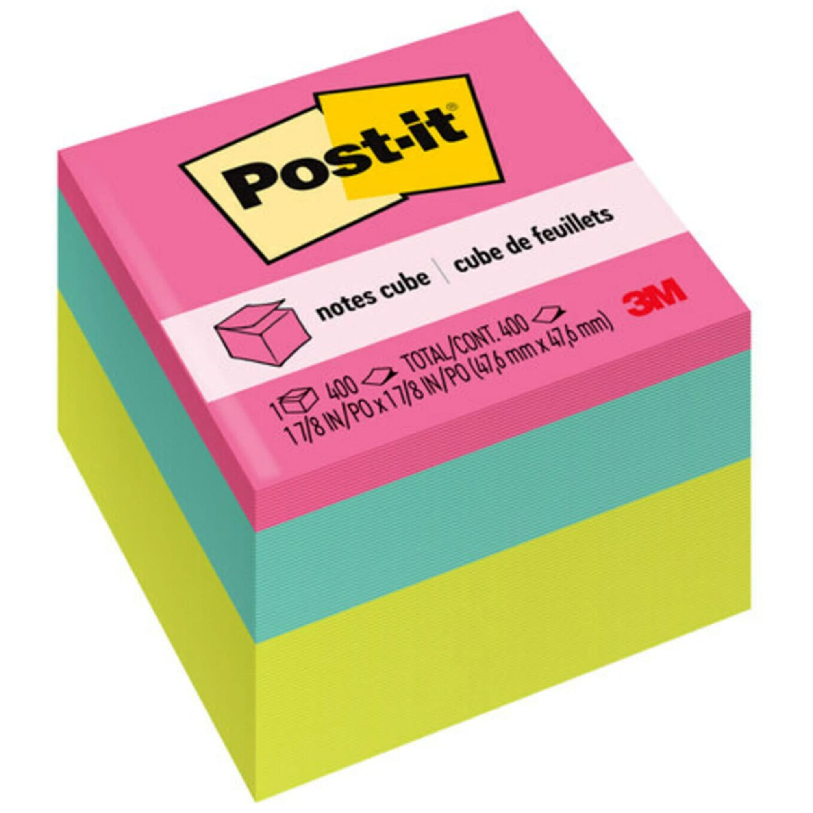

Another one of those things that’s just handy to have around. I have a stack of post-it notes on my desk that I find myself reaching for several times a day to take note of small things that immediately spring to mind. They’re also useful as physical reminders. If, say, you remember that the bins need to be taken out, but you’re too busy *right now* to take them out, you can write a reminder on a post-it note, stick it to the bins, and get back to what you were doing without breaking your concentration too much. This is mostly how I use post-it notes, and they’re such a useful tool for those of us who tend to forget things as soon as they come to mind.

### [A medium-sized whiteboard](https://www.amazon.com.au/Magnetic-Whiteboard-Silver-Aluminum-905X600MM/dp/B07HNRQZGM/ref=sr_1_5?crid=3M9CJKG9EGSN9&dib=eyJ2IjoiMSJ9.EyQ_0EX8cYPcxmAH8Sup_mmg1A2tlT3c_zTrI_fNKcG-qusZIb2i9q7LbjILuByHdhm4MAMiiLTC-PGXnWNB_1gZde2-11oAZmbVQvqDoNMclYIuP9CTI0JgBuHd6BlgXXqD9rbCTMPsHMB966VTNaKhZMUvVfQz3rPSaWYVd5RtYH298YEtAJyQBabgAtB4ZgXlbfA_tgClklG0-ZdJsJKKw-EjfeH0E19avyRu4kP11c4zhzJie6CwfT6RxxSZnHPtad1bgY4snajncm04mt86Tt32emh8-yXMclpsEPs.rKMuzIKP_EBxooI_Qn1Tl-DpT7r6Bs9QasfUSGWUpE4&dib_tag=se&keywords=whiteboard&qid=1724209930&sprefix=whiteboar%2Caps%2C249&sr=8-5&th=1) — $60

 
 
A whiteboard with [some](https://www.amazon.com.au/QUARTET-QTTWC250-Quartet-Whiteboard-Cleaner/dp/B075ZZW9X8/ref=sr_1_5?crid=290AMQ0ICPVVA&dib=eyJ2IjoiMSJ9.8qBNFOXuKDliHOxIZQDjG_fMEeBDsN8Bn3xjsbKqMMoCLc73FMqOG3oaN_ck1lBjlpj88U2ejDxYJO7YYFFmNZvKCuTYy2xp3Gnl_i6mgTOEUk2SVfbla8KaCBuPyZisHyL5AT-Jw-Y_oiVvQaghtOSOz6N3DXl9_hKFLnJnK36Xo5VUksbhhzFgOcE047DxsO-qZkBShiVDDUmqbCHfqiIwetCPvhKL0wAYZNWle8g0M3zM1lACzmyPzCjKlFWK_NsqA1F-dMFBaksso85cdKi7ooy3t2sP1IljV_oscXo.bEtrKCAonVS0MU6bFCRmaFYW-8ZYFYUgYeZs-rIhCUc&dib_tag=se&keywords=whiteboard%2Bcleaner&qid=1724210091&sprefix=whiteboard%2Bcleane%2Caps%2C248&sr=8-5&th=1) [good](https://www.amazon.com.au/Post-Whiteboard-Surface-Cleaning-DEFCLOTH/dp/B00NC1D5OC/ref=sr_1_4?crid=1EAHU9LFJ1BE0&dib=eyJ2IjoiMSJ9.gTflIFLGHGWeDjXagduTbvUjIvYA-DUailR-mFp5d5ddan2pOuZZQJ0qieogw8aoxOgsitgfsp6RVfTHdsNBV0B1iMsseSz509aSd5AuY7OAczC6fOmV6c3OZoSd-kDzfM5mrr_Jg51O7qnXSNydkvJIMmklCvSN-6PryfSGkc7FJ5E8kSSKXEMSJ1fOHmxAgn0h3ijdNQP_E9J4QIF91XgMvPHytb_3YMvfl2171O3T0c4tUTDpadQwjp9DjvCs-UGf09A-Na6QK9y4k5x5hFgIP3dGbQpqZpk_6hIsU-U.SxTPz0a9qmM2hdigLOGxRUtEhvSm7LIUS1WluXhYZss&dib_tag=se&keywords=whiteboard%2Bcleaner%2Bcloth&qid=1724210114&sprefix=whiteboard%2Bcleaner%2Bclot%2Caps%2C244&sr=8-4&th=1) [accessories](https://www.amazon.com.au/Magnetic-Whiteboard-Storage-Organizer-Cabinets/dp/B0B3T7X5BD/ref=sr_1_5?crid=3I7DXBT9CFGO8&dib=eyJ2IjoiMSJ9.fBQ5WcfMhafqxJyXs1e9al4aScIFaFkkO6c51yjQIg_UZkP7OEutpr4bc654QKiUujywO-1WN78KmT6NO5X1qmhtaiyhgcL5_oucCXSlVbLgGdy6DDtA5cKZYqLGmgvKio59s4l6NoAyALO-YgzsL8iF9P--C29_iiN8NWf2_z0WwpOP10yw2_umCuxXhuQhRUUt_lRH4YbPqQBAgxAQCWEx9CRdURqsLkX9LPUstsbB_Ep9hBopB62aaECJUztI0v1fyWtINu4UNXdHYBgN073-vpv30w9lHFWoUuSBU3I.5vDqIxmsegKmUolVgpm35X7uJY_aaDyU-S_sRDBGub0&dib_tag=se&keywords=whiteboard%2Beraser%2Band%2Bpen%2Bholder&qid=1724210142&sprefix=whiteboard%2Beraser%2Band%2Bpen%2Bholde%2Caps%2C244&sr=8-5&th=1) and [pens](https://www.amazon.com.au/Staedtler-Whiteboard-Lumocolor-351-WP6/dp/B000KJMJ5K/ref=sr_1_8?crid=3U93H3YBKBSEQ&dib=eyJ2IjoiMSJ9.bjzqmpp6Xh-_UHBNERKRuHmg24JgQj4qvLXoRx59YJ5uuUm-miWmLV5X1kXbgd3iZZruVPShVmmAxYT4KG83VJyzvdCx3UXn1P7n6tmsjUpwyDijtRtuoyppxlquxCEXN5Xe8R1V48uAP0p1jx9lfyN9OPq8TaUgpwzz5MqnDuW6jIa80R7-wRJgIc0MfHcpMIH6AdX5Fc8KHR9uS-O7_rgFN8f_zuZfNby7CWSGSx5XgRrmbz9bM5cjJNYTwWnGkjgPayIf2DH4ayzPitQ4spki_elCD0PPHXOs2QNmeK4.rGjvBMMKTHq5VHSZYofAReBDgYQQpxUIEezB-YqBlwQ&dib_tag=se&keywords=staedtler+whiteboard+pens&qid=1724210199&sprefix=staedler+whiteboard+pe%2Caps%2C247&sr=8-8) has been incredible helpful for my organisation over the past few years. I don't have this whiteboard exactly - I instead used a [Post-It adhesive whiteboard](https://www.amazon.com.au/Post-Whiteboard-Erase-Surface-DEF3X2/dp/B00NC1D5YM/ref=sr_1_1?crid=CY2HAE7L6619&dib=eyJ2IjoiMSJ9.9DXYWLHU1EwNB5gfeY00JbvDiiJsY9VZ_bXpGyP5rKh1KDvwmIPF9aunyEs98edzrSv5QEYDj3ncfgvHxLAjY7SiA37oYYh9iolPlLHfvCoVVwhKPDSJTLUlCjblx9Xu-TT_XGOZH2efnhUhJOZxsZogmJBEPV6EczSTJPAvj_DeYurdpas8TszPOP5a5HmIuYW6lNXZDkVB9CZXHDK2fvEdSqDPUVGYpdbYOjy20T7hOQmoLZ4-md8OUhMHE2CYXqrC6wHIJ_l3Y0WQqOTwkrWsta-MCn3zCotKgUIPV18.bjuRl2rGff0qnEiDK-lyD6z-XfX-A72P_GNhtKdYzNA&dib_tag=se&keywords=post%2Bit%2Badhesive%2Bwhiteboard&qid=1724210330&sprefix=postit%2Badhesive%2Bwhoteboar%2Caps%2C247&sr=8-1&th=1) and some MDF to make my own and stick them to my cupboard doors - but I can nonetheless recommend it. My whiteboard serves as a scratchpad for ideas and is often the first place I’ll write things down when trying brainstorm or fix things. It’s also really handy for explaining ideas that work better with a diagrams, or when I have to work on ideas with a group of people, as everything can be easily erased and moved around.

It’s also a very handy way to plan a week, note down any tasks that need doing without having to use any kind of software (like my beloved Todoist), or just generally organise your life. It’s a freeform reusable canvas, and it’s well worth the money for the time and mental energy you can save by using it as an outboard brain.

# Other things I like that aren’t cheap

- [Epson Perfection V39 II scanner](https://www.amazon.com/dp/B0C35V1CLK?ref_=mr_referred_us_au_au&th=1&source=post_page-----b442d74874e8--------------------------------) — $181
- [Sketchers slides](https://www.skechers.com.au/hyper-slide-reliance-229040-bbk.html) — $139
- [Samsung T7 External SSD 1TB](https://www.amazon.com/SAMSUNG-Portable-SSD-1TB-MU-PC1T0T/dp/B0874XN4D8/ref=sr_1_1?crid=2CIWLBGK28D3T&dib=eyJ2IjoiMSJ9.1e7xIf9mgHwLWvSeT6yTUl_2bd4_XxTNWVGoDe8wDtGkhuwXHgufVjAgoQjwbC2OCsiI5tONxNrp05ShANUy1zN-vBDQ6zfjHd4M7mo9AHpamEFQJG0_vbt38moKoAWyazDNroOquaH3VPRXVEbgMhskvgVgobpBBo9tKjwKvsWXIERs2VROTnW1tqs5kLgmt5JKu-UOJ665UXOkyRyh-tdQ-upcyulAEzJThv4du5I.7dNIhkW-cZ8t7Pj5BTQGkUcSXuvTtpQBI7VyNCWnEHM&dib_tag=se&keywords=samsung%2Bt7&qid=1722748303&sprefix=samsung%2Bt%2Caps%2C431&sr=8-1&th=1)— $154
- [Leatherman Rebar](https://leatherman.com.au/collections/multi-tools/products/rebar%C2%AE-stainless?variant=37789298917538) - $194