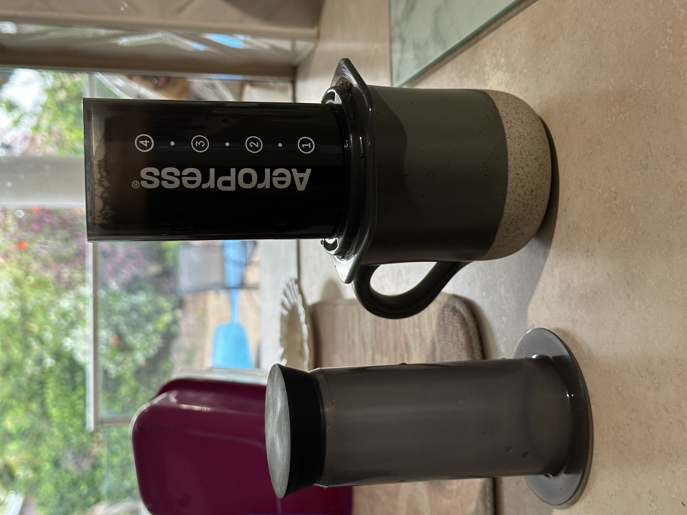

# Preamble

I recently got into coffee.

I’ve never been much of a coffee person, but unfortunately my usual morning earl grey tea wasn’t giving me the kick I needed to deal with the general drudgery of being a university student. Coffee seemed like an appealing solution (at least more so than amphetamines), but I had no idea where to start or what to buy, so I turned to the internet for answers.

I quickly learned that the best way to make a good coffee is by grinding the beans at home, which in itself is not complicated unless you make it so. Fortunately, my dad has a simple bladed grinder that he was willing to share with me, which saved me from going down the rabbit hole of trying to find and buy my own grinder.

***An aside:** many of these machines insist that their way of turning beans into powder is worth a $500 premium (or more). Reader, I assure you that a coffee grinder is not worth more than the money you will earn with it. If you make coffee professionally, then perhaps a grinder with various settings and dials and discs and whatnot might be worth the extra cash, but a [simple grinder](https://www.bigw.com.au/product/contempo-coffee-grinder-black/p/131637) will do just fine for most people.*

With the problem of grinding the beans solved, I had to find some way to brew them. This where you can really get into the weeds about which method makes the best coffee. It seems like there’s as many ways to brew a cup as there are people who are into coffee, but I was looking for something simple, quick, and fairly inexpensive. I came up with two options: a [drip coffee machine](https://www.breville.com/en-au/product/bcm700?sku=LCM700BSS2JAN1) or an [AeroPress](https://aeropress.com.au/).

Ultimately, I chose the AeroPress. I don’t drink a whole carafe of coffee in a day, and I didn’t want to have to deal with cleaning a drip coffee machine. I also didn’t fancy having a tank of water sitting on the kitchen counter, especially during the heat and humidity of summer in tropical Australia. The fact that the AeroPress could make just one cup of coffee at a time was the best feature to me, and it also seemed super easy to clean. I bought mine with the [Prismo attachment from Fellow](https://fellowproducts.com/products/prismo), because it seemed like less hassle than paper filters and eliminated the ongoing cost of purchasing them. All up, it cost me $109.85 AUD, including shipping. Not a bad deal, I reckon.

# Using the AeroPress

Using the AeroPress is really straightforward, especially with the Prismo. Unlike other methods, there’s very little preamble to making your coffee besides the usual bean-grinding and kettle-boiling. After that, you just pour the grounds in, pour the water in, stir, let it brew, and press. It’s a really good way to reliably get a good coffee. However, the trick to mastering the AeroPress and getting a *really* good cup is in the finer details. Here’s my process for getting coffee the way I like it:

1. Grind the beans a little coarser than you would for an espresso brew. While the AeroPress does rely on pressure like an espresso machine, I found that a finer espresso grind creates a more bitter flavour, while a coarser French press grind doesn't provide a good extraction. Somewhere in between those two is where you should aim for with grind size.
2. Let the kettle heat up to just before a rolling boil. If you have a kettle you can control the temperature of, that’s about 90°C/195°F. A higher temperature tends to create a more bitter brew, whilst cooler water can’t extract some of the finer flavours of your beans and can make your brew feel a bit flat and uninteresting. Of course, this may depend on the type of beans you use. More on that later.
3. Fill the AeroPress up to the ④ mark and stir until the grounds are fully incorporated. This may be a little easier with a gooseneck kettle designed for pourover coffee, but any kettle works fine. I’ve noticed that the water level drops slightly as the space beneath the metal filter of the Prismo fills up, so I make sure to top up the water level as I’m stirring.
4. After stirring, let your coffee brew with the plunger off for 1 minute. Any less time and your extraction may not be as complete, so the flavour profile of your coffee may not be very well-rounded. Any more time and you’ll get a much more bitter brew, which I personally don’t enjoy.
5. Push the plunger into the base and press ***gently.*** Pressing is in the name of the AeroPress, and it’s arguably the most important part of the process. This is where the espresso-meets-french-press strangeness of the whole contraption become clear, and it’s where most of the extraction occurs. Only a gentle pressure is needed, and this can be achieved simply through the weight of your arms on the plunger. This is also the reason for a slightly coarser grind — finer grinds require more pressure, and more pressure creates a greater extraction, which can lead to bitterness and acidity. Coarser grinds need significantly less pressure, and create a smoother, richer, more full-bodied flavour with minimal bitterness and acidity as a result.
6. Season to taste. I use whole milk and a teaspoon of raw sugar, but you can use whatever you like. This process should serve as a starting point, and I encourage you to modify anything in here to suit your taste. Coffee is entirely subjective, and however you enjoy it is the best way to make it.

It should be noted that while the brewing process does have some impact on the final flavour of your coffee, most of the flavour will come from the beans you start with. Coffee shops nearby are a good place to start looking for good beans. If you find a coffee that you like from a local cafe, ask if you can buy a sample of their coffee blend to take home. If you have a local roaster or distributor near you, it’s worth paying more to get some good beans from there too, rather than going to the grocery store for your beans. As James Hoffman said - [grocery stores don’t treat coffee like food](https://www.youtube.com/watch?v=O9YnLFrM7Fs&t=720s). It’s worth finding places that treat coffee well, and take pride in selling fresh, traceable beans.

# The results

For my first foray into coffee, I think it turned out pretty well. I can reliably get a good coffee with minimal cleanup, and it makes my mornings much more tolerable. It provides me with a nice little ritual, and has given me something else to do with my hands and eyes in the morning that isn’t reading my emails and scrolling Threads. If anyone reading this has become interested in making coffee at home, I highly recommend the [AeroPress](https://aeropress.com.au/). It’s a great entry into brewing at home, and I have a feeling that it’ll be the first and last coffee gadget I buy. I’m very happy with it.