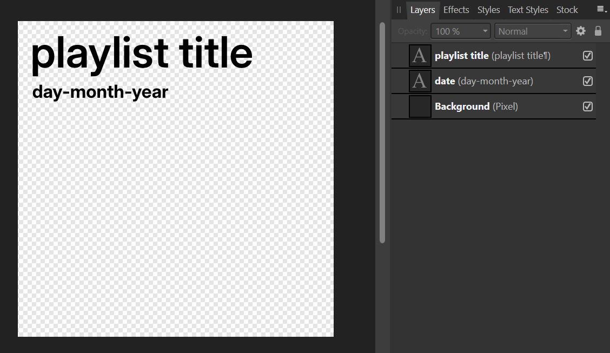
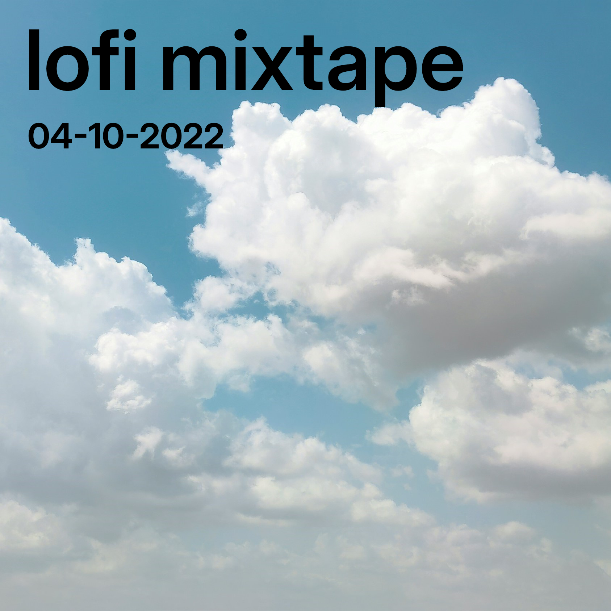

I like to make playlists, if only to decorate the covers. I use Spotify, and while the standard album grid it creates for each playlist is fine, I like to make things a bit more personal. This is more of a guide for myself than a showcase of my work, but I’ve provided some examples at the bottom of this post and included steps that would be easy to replicate in any modern photo editor, should you be inspired to make your own playlist art. 

I work in [Affinity Designer](https://affinity.serif.com/en-us/designer/), because Adobe doesn’t need any more money. To make things easier for myself I made a “.styleguide” file, which serves as the starting point for all my cover art. Currently, it’s formatted this way:

- A 1687px x 1687px empty canvas as the background,
- One text layer which contains the playlist title (Inter Display Semibold, 230pt) set 80px in from the left and 80px down from the top,
- Another text layer for the date (Inter Display Bold, 98pt) in DD-MM-YYYY set 80px in from the left and 340px down from the top.

The layer structure of .styleguide in Affinity Designer.

Previously I used Spotify’s Circular Semibold font to match the theme of the Spotify interface, but their recent changes in branding and font choice forced me to choose another option. I settled for [Inter](https://rsms.me/inter/) as a widely recognised, open-source alternative. I also chose to use the DD-MM-YYYY date format rather than the standardised [IOS8601 YYYY-MM-DD format](https://en.wikipedia.org/wiki/ISO_8601) because, to be frank, *it just looks better this way.*

To create the cover for my playlist, I follow this process:

1. Find an image that I’d like to use as the background. 
2. Crop the chosen image to square (if it isn’t already), place it into the “Background” layer, and resize it so it fits perfectly. 
3. Edit the title block to display the name of the playlist
4. Edit the date block to the date that the first song was added to the playlist. 
5. Depending on the colour of the background against the text, I will change the text colour from black to white to aid visibility. 

For my normal playlists, I’ll usually browse [Unsplash](https://unsplash.com/) to find a photo that fits the vibe of that playlist the best. My monthly playlists use a photo that I took that month as the background - one that I feel  represents the overall vibe of the playlist. I set the date to  when the first song was added. 

After the design is done, I export the cover in three different formats.

1. As an Affinity Designer file (.afdesign);
    - This file is completely uncompressed and can be opened at any time in Affinity Design should I wish to make changes.
2. As a .TIFF file with 16-bit RGB colour and layers turned on for compatibility;
    - This is an open format that any photo editor can work with. By saving it in 16-bit colour and with layers on, it provides me with a completely useable backup of the Affinity project should I ever choose to use a different photo editor.
3. Finally, as a .PNG which I can upload to Spotify and use as the cover art for my playlists.
    - I prefer to use a PNG instead of a JPEG, because the lossless compression of the PNG format means that colour banding or artifacts from JPEG compression are a non-issue.

The completed cover art for my personal lofi mix.

The cover for one of my monthly playlists. Note the white text, which is easier to read in this context.