I really enjoy woodworking. I like watching videos about it, I like learning about it, I like the tools, and I _love_ the kinds of things people can make out of timber. Unfortunately, most of the experience I’ve had with woodworking came from a furnishing skills class in high school several years ago, and I've only had limited access to fine woodworking tools or machinery. I wanted to create a space for woodworking in my shed - one that has most of the functionality of a proper furniture shop - and a key part of this was finding a good table saw.

# The saw saga

I had decided to get a table saw as that would give me the precision I wanted to create custom furniture. However, I didn’t have enough space for a full-size cabinet or panel saw, and needed to find a good jobsite saw that would fit the space. I ended up choosing the Makita MLT100N — a decision I would come to regret.

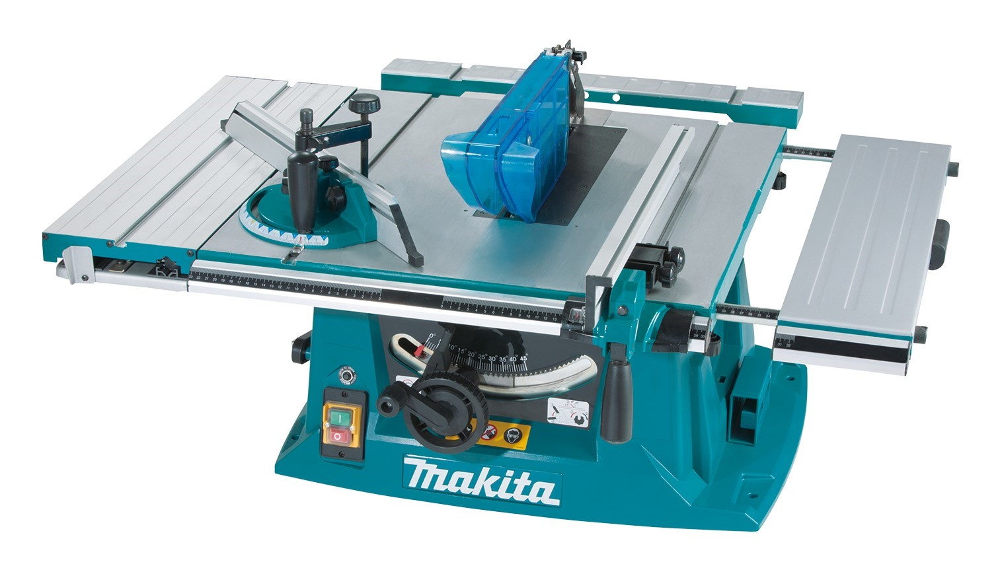*The Makita MLT100N. It looks like a good deal on paper, but it has some critical flaws.*

I saw this Makita table saw on display for the excellent price of $750 AUD whilst shopping for a new mitre saw. It was a bit of an impulse purchase, especially since it was only $100 more than the mitre saw I was looking at. A table saw can do the job of both a mitre saw and circular saw with the appropriate jigs, which made this saw looked like a great deal on paper. It also offered a wide, extendable table, and a sliding section similar to a much larger panel saw. However, it came with a significant flaw that wasn’t immediately obvious: the fence was not stable.

Most table saws, even cheaper jobsite saws, have a fence that attaches on both the front and back of the table. The Makita, however, did not. The fence was a thin rectangular piece of extruded aluminium and was only attached front of the table by a simple friction clamp. While this made it easy to move, it also made the fence _flexible._ The only part of the saw that was not supposed to move _at all_ was this part, and it _did_. This flexibility made it inaccurate and entirely unsuitable for my needs, so after it sat in its box on the floor of the shed for about two months, I returned it for a full refund. To the generous staff at Total Tools, I thank you.

After doing my research (this time), I settled on the Hikoki C10R jobsite saw. This saw had the ideal fence: a rack-and-pinion system that was attached to the front _and_ back of the saw, which made it incredibly sturdy when locked down and _very_ good for precise adjustments. The fence was attached to the rack by some very sturdy clamps, which made it easy to precisely align with the fence with the blade by placing a straightedge along the blade and pushing the fence up against it. It also came with a fold-out cart that bolted onto the saw, making it very easy to move and set up. [This review](https://www.protoolreviews.com/hitachi-c10rj-table-saw-review/) goes into more detail, but the bottom line is this: **It’s a _really_ good table saw.**

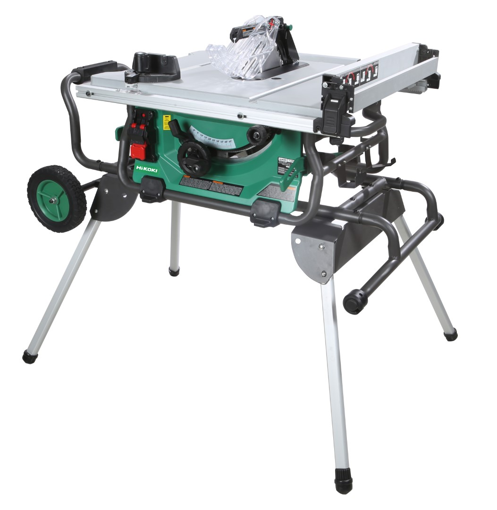*The Hikoki C10R jobsite saw. This thing is great, and it makes an excellent base to build a workbench around.*

# The plan

The goal for the shed was simple: **build a sturdy workbench that will fit in the limited available space and serves many purposes.**

As I said earlier, I really wanted a table saw, and so I began to plan a workbench that would be built around a jobsite saw. However, I couldn’t get too detailed with plans and 3D models because I didn’t know the final dimensions of the saw that was going to be used in the bench. Initially, I had planned to use the Makita table saw, but after exchanging it for the Hikoki saw, the rough dimensions I had planned didn’t match. Ultimately, the plan for this bench was nothing more than a vague sketch on my whiteboard and some basic ideas for joinery.

I initially planned to use fully surfaced (S4S) pine for the finished build, and had some idea about the dimensions of the timber I would use. An afternoon at the hardware store arranging boards in the timber aisle confirmed that the rough sketches I made would work well, but I decided against S4S timber once I saw the price. For the timber pictured below (plus a few extra boards), before any screws or other hardware, it was going to cost me $622.7 AUD. You read that correctly, dear reader. **Six hundred and twenty-three Australian dollars.** (and for pine! _PINE!!_)

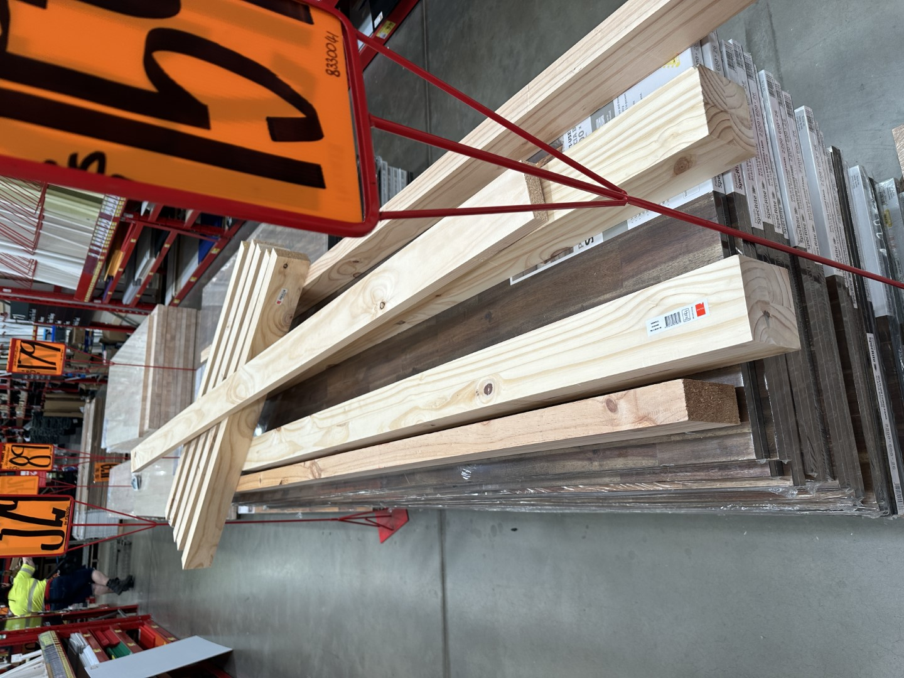*Ridiculously expensive timber.*

I decided to use construction timber in the end. Bunnings had some 2.4m lengths of 90x35mm structural pine, which were about $24 each. I bought nine of them. I also decided to keep the two larger 90x90mm square posts, as I planned to use them as the legs of the bench. Those pieces each cost $76. The top was to be made of two 1200x597mm pieces of 12mm thick film face plywood, as the black film coating would stop glue from sticking to the workbench. Those two were $25 each. The rest of the bench hardware (the castors, post anchors for the castors, screws) added up to around $100. The total cost of the bench came to about $520, which is a _lot_ more than I was intending to spend. I think it’s worth it though; a good sturdy workbench should last a lifetime, and that’s exactly what I’m making.

# The demolition

The plan for this new bench was to replace an existing bench in the shed. The existing bench was fine as a work surface, but it was quite shallow and not really all that useful for woodworking. I tore out the old bench in an afternoon with the goal of salvaging as much timber as I possibly could.

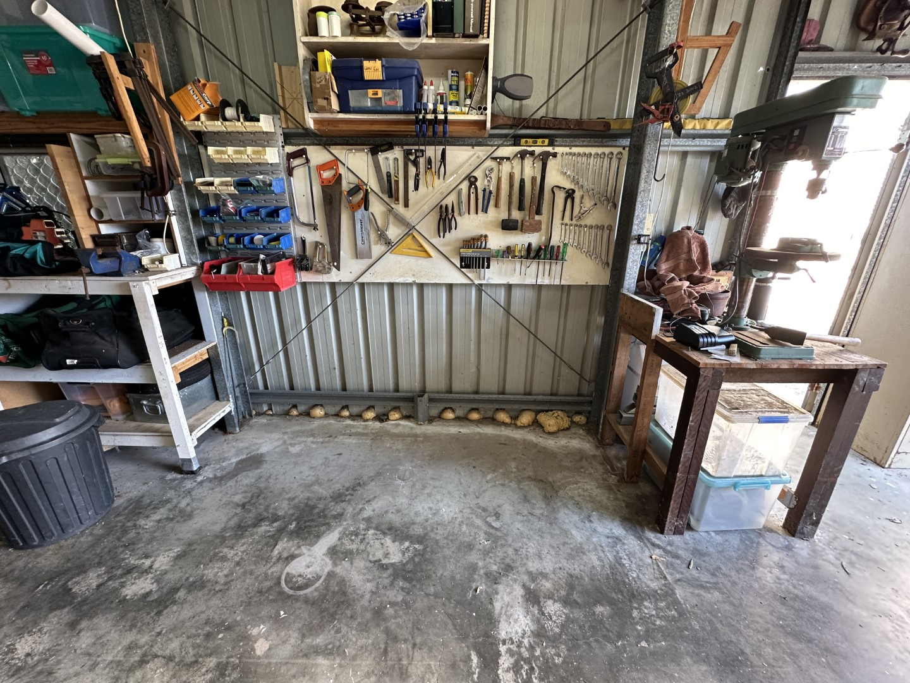

The space where the old bench was. Fortunately, it was exactly 2.4m long.

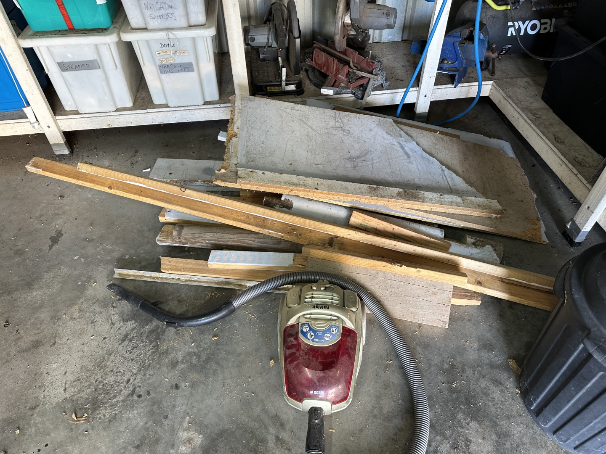

The pile of timber that I recovered from the old bench. There was some useful material in there, but nothing that was of much use for building the new bench unfortunately.

# Day 1: Learnings and leg assemblies

After the old bench was demolished, the new bench could be built in its place. My Dad was building this bench with me, and we only had the weekend to start and finish this entire project. As much as we would have liked to get to building straight away, we had to learn how to use the new table saw first. In preparation for this new tool, I watched a lot of videos about table saw safety by [Stumpy Nubs on YouTube](https://www.youtube.com/@StumpyNubs), so I had some ideas about the do's and don't’s of table saws.

The legs were the first thing that we decided to cut. The plan called for legs about 900mm tall, which meant that the larger 1.8m lengths had to be cut roughly in half. I say roughly because a mounting plate and a castor was to be attached to the base these legs, and the desired finish height of 900mm meant that more would need to be trimmed from the legs to account for the height of the castors and their mounting hardware.

The first cuts on the table saw ended well, though it wasn't without a hitch. We didn't have a crosscut sled, only the simple mitre gauge that came with the table saw. While it did fit in the mitre slots on the table, it was quite loose – I observed about 1.5mm of play. This, and the limited checking we did to check that the blade was *actually* square to the mitre slots, meant that the cuts came out slightly angled. We decided against making a fuss about it – and any small angles in the base could easily be accounted for with the castors.

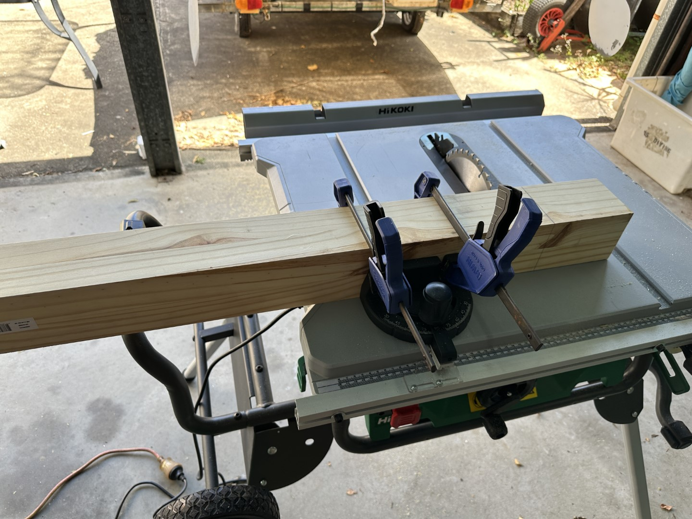

The sketchy-looking setup I used for trimming the legs on the table saw. No fine-tuning here - just send it through.

The castors required some mounting hardware in the form of post brackets, as the castors would otherwise have to be screwed directly into the end grain of the legs – something that I would rather avoid for a secure attachment. Unfortunately, the bolts that we bought to attach the post brackets to the legs were slightly too large, so the mounting holes had to be drilled out. We used the leg offcuts to stabilise the post brackets while we drilled out the holes in the drill press. They didn't end up perfect, but they fit the bolts that we bought.

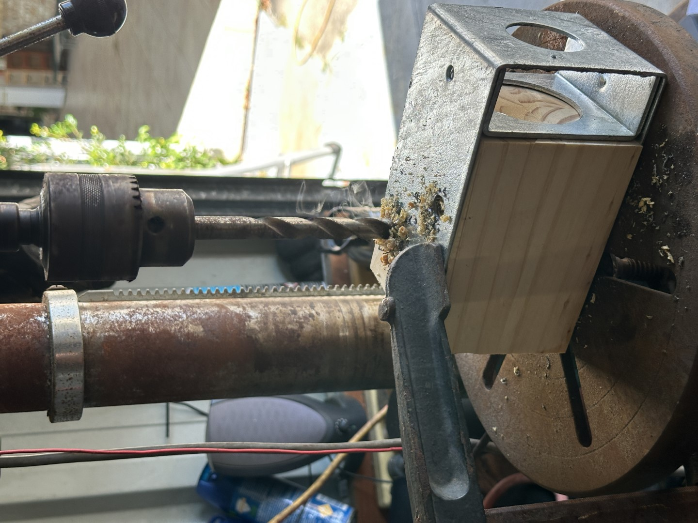

We then drilled the legs, which was a bit of a challenge. A few of the holes in the legs didn’t align with the holes in the post brackets, but with a little fiddling and drilling they ended up fitting, and all the post brackets were bolted to the legs. To get the measurement for the top and bottom rails for the legs, we measured the depth of the saw’s table, excluding the fence and the hardware required to move it. We cut the rails to that length with our old mitre saw (which doesn’t cut very straight anymore) and screwed those onto the legs to make two finished leg assemblies.

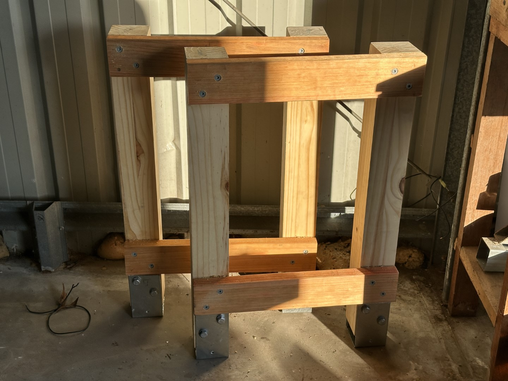

The finished leg assemblies marked the end of Day 1. While not much actual woodworking happened, we learned a lot about how to use our new table saw. Given that this new workbench is being built around it, it seems worthwhile to know how to use it well and how to be safe around it.

# Day 2: The rest of it

Sunday: The Big One. The goal for this second and last day was to get the rest of the bench finished. A lofty goal, perhaps, but certainly manageable.

We started by building the rest of the frame. Thankfully we didn't have to do much cutting for this step, as the bench was planned to be 2.4m long and our boards were already just a little over 2.4m. We squared up one end on four boards, measured from the square end to *exactly* 2.4m, and trimmed any excess. These four boards would be the top and bottom rails for the front and back of the bench. The issue now was attaching everything so the bench was square.

We clamped all the rails to the bench and laid it on its side, so what would be the back was now the bottom and what would be the front was now the top. After making sure the rails were aligned by eye as best as we could, we checked for square by measuring from corner to corner on both the top and the bottom of the bench. The whole thing was out of square by about 50mm, corner to corner.

To square it up, we used a length of rope and a hammer (in lieu of a ratchet strap). We looped the rope around the rails we attached to the legs yesterday and use the hammer as a lever to tighten everything up. After about an hour of tightening, hammering, checking for square, and tightening again, we finally got the whole bench to within 1mm of square, corner to corner.

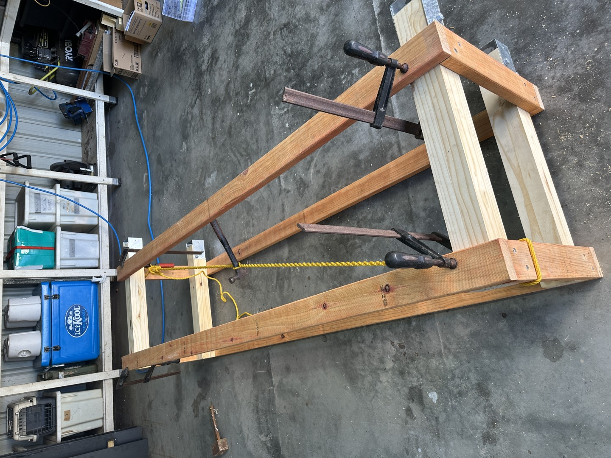

The ratchet-strap-torniquet-style contraption we used to square the bench up. It worked quite well.

With everything squared up, we screwed all four rails into the legs, completing the basic frame for the workbench. We then had to add the vertical supports for the section that the table saw was to sit in. We measured the length of the table saw first, so see what we were working with. Then we divided the table saw length in half and measured out that amount from the centre of the bench such that the saw was exactly centred in the bench. The vertical supports were cut on the mitre saw to exactly match the height between the top and bottom rails and screwed into the positions we marked earlier.

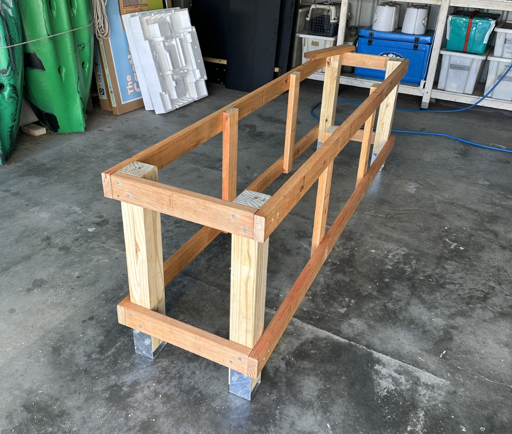

With the vertical supports installed, the top and bottom cross-bracing was next. These pieces were cut to fit inside the vertical supports, and they were screwed in through both the top and bottom rails and the vertical supports with some 100mm baton screws.

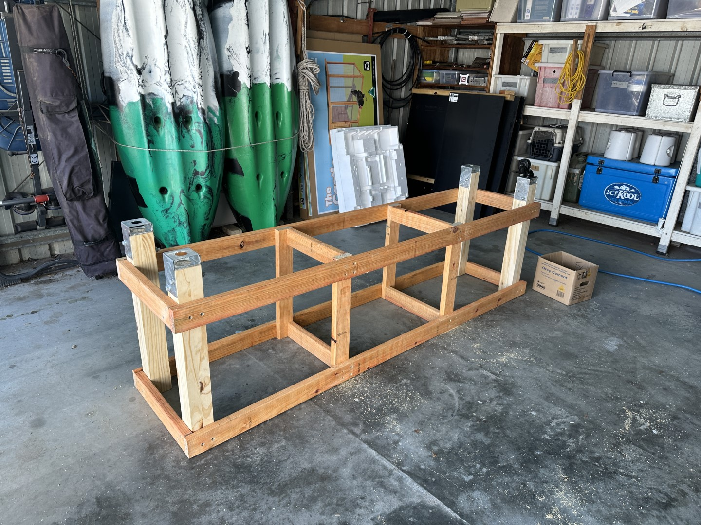

We flipped the frame upside down here in preparation to mount the castors.

The castors were relatively simple to install. We marked out the layout of the mounting holes in the baseplate of the castors onto the post brackets, pre-drilled the holes for the self-tapping sheet metal screws, and drove them in.

Before fitting the saw to the bench, we had to cut out a section of both the top rails. This timber was repurposed to create supports for the plywood top.

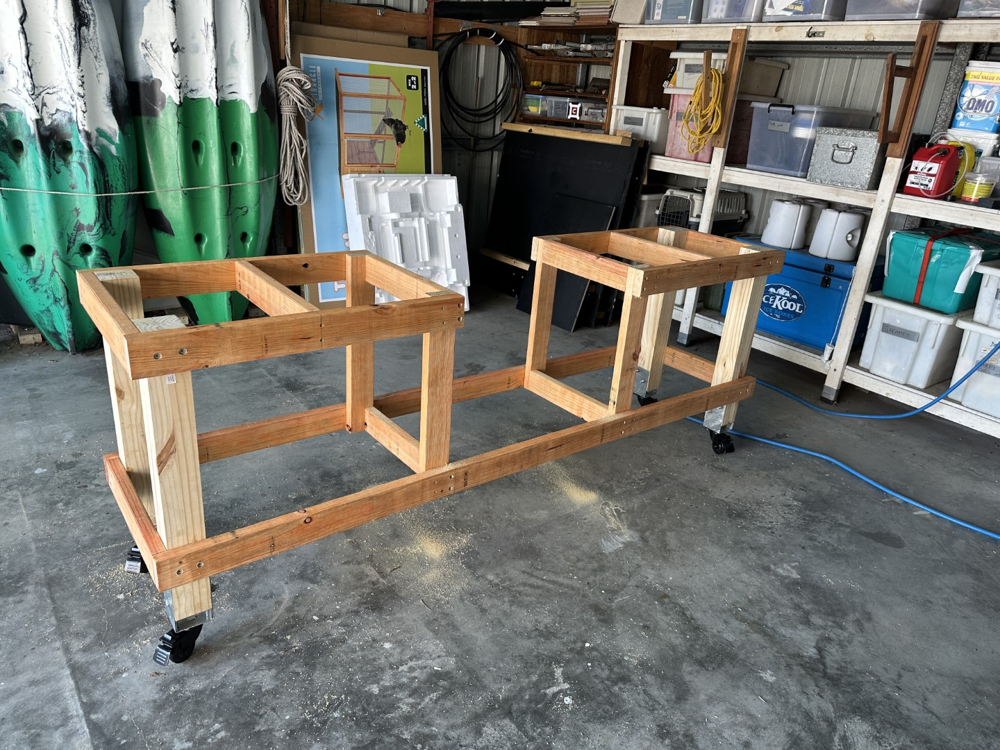

With the frame of the bench complete (aside from the structure that would hold the table saw, of course), I began breaking down the plywood pieces to fit the bench frame. I used the flip-down component of the fence to support the wood that was overhanging the table saw and found that the wood was catching on both the fence and the table. This was quickly resolved with the help of a light coating of silicon lubricant. I know, this isn't technically the correct way to lubricate the table or the fence, but it's what we had on hand. We only had a limited timeline to complete the project, remember?

We screwed the bench down with 44 screws in total. I mention this only because it seems excessive in retrospect. This benchtop would probably have been secure enough with about *half* as many screws, but I wanted to be sure that it wouldn't go *anywhere.* The screw pattern looked like this:

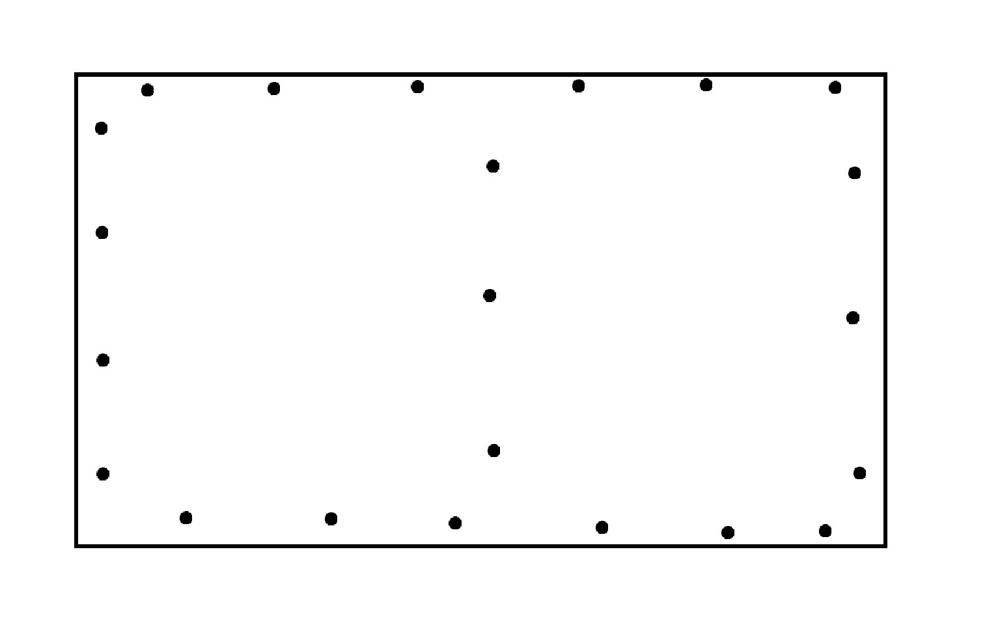

This was not the smartest or most efficient use of screws, but at least I’m certain that this benchtop truly won’t be going anywhere. In the future, I’ll make sure I plan my screw layout more carefully. Regardless, we secured the plywood tops to the bench frame. It’s really looking like a proper workbench now.

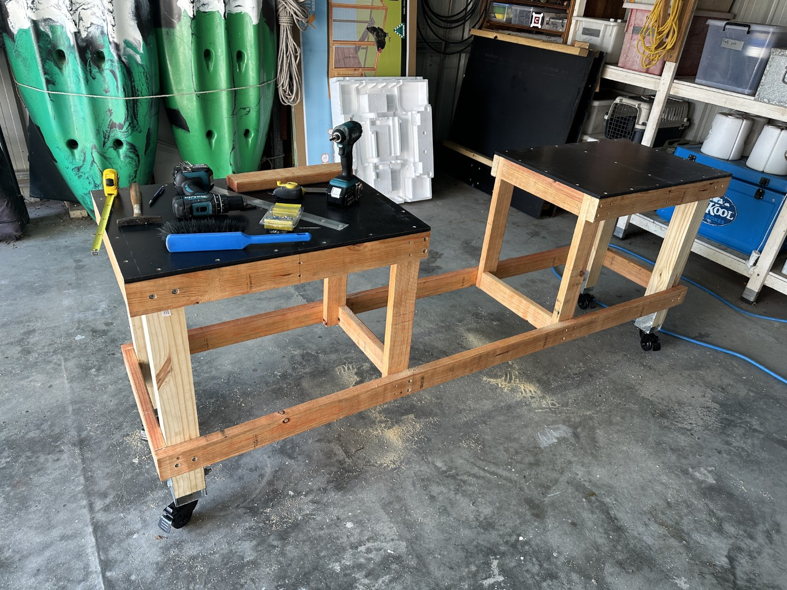

The next stage was the most critical, and the culmination of the entire project: fitting the table saw into the workbench. We measured the height of the saw from the top of the table down to the attachment points to the cart and translated that measurement to the vertical struts, measuring down from the top of the workbench. Using the last 2.4m length of our timber, we cut two pieces to length so they overlapped the vertical struts entirely and clamped them tightly in place at the lines we marked earlier. We then took some of our other offcuts and trimmed them to size to form a sort of floor for the saw to sit on.

Now for the moment of truth. We detached the table saw from its cart and slowly lowered it into the gap in the workbench. Alas, **it did not fit.** We had to make some emergency modifications with the circular saw to trim just a few millimetres off either side of the gap. With those small adjustments made, we slowly lowered the saw back into the bench. **Success!!** It fit perfectly, with just millimetres to spare on either side of the table. This job wasn’t over yet though.

We had to adjust the height of those horizontal supports, as the saw was sitting just below the finished height of the workbench. A few taps on each corner with a mallet and some checks on the surface with a level, and we had the saw flush with the surface (or actually just a little proud, if only to account for discrepancies in the bench construction). With that, we screwed the horizontal supports in place, and the saw was (sort of) mounted.

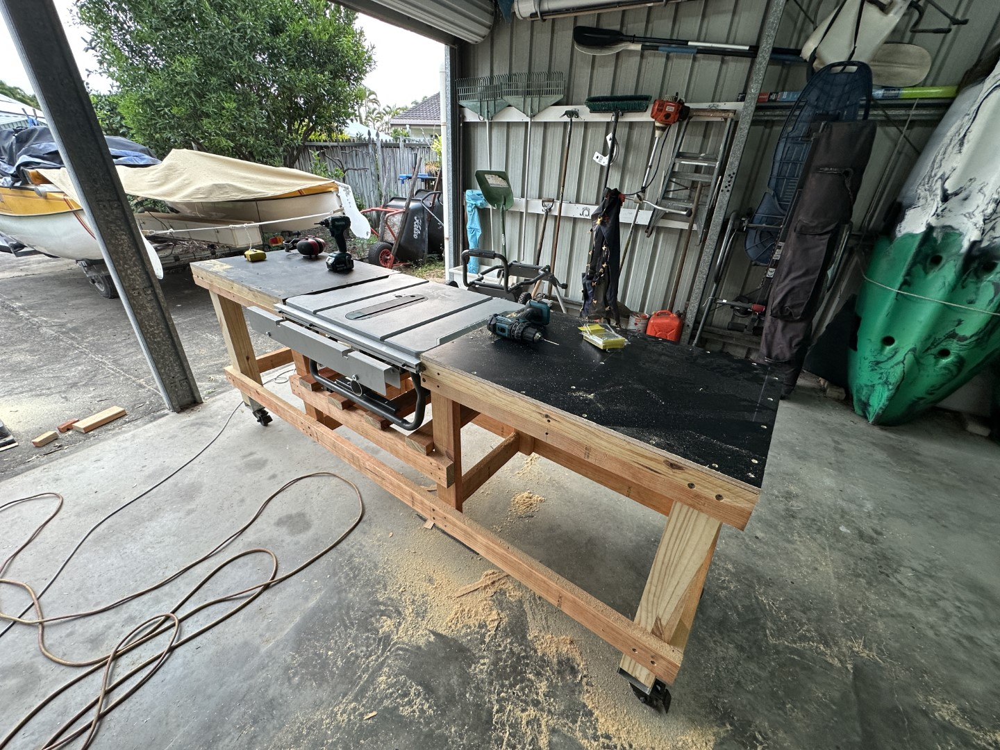

However, we encountered a problem. Somewhere in our measurements, we had made the bench *just slightly* too deep. Not by much, just a few millimetres, but enough that the fence couldn’t extend in either direction no matter how we moved the saw. We pulled the table saw back out of the cavity and decided that we had to make another emergency modification with the circular saw to make everything fit.

We didn’t have a straight edge long enough to make the cut the whole way across the bench, so we had to use the longest plywood offcuts we could find and clamp them together to make a suitable straight edge for the cut. I sunk the screws further into the bench with the impact drill just to be certain they wouldn’t hit the saw blade, and my dad plunged the saw to its deepest possible cut depth and removed the thinnest slivers of material he possibly could. It was the most stressful cut of the whole project by far.

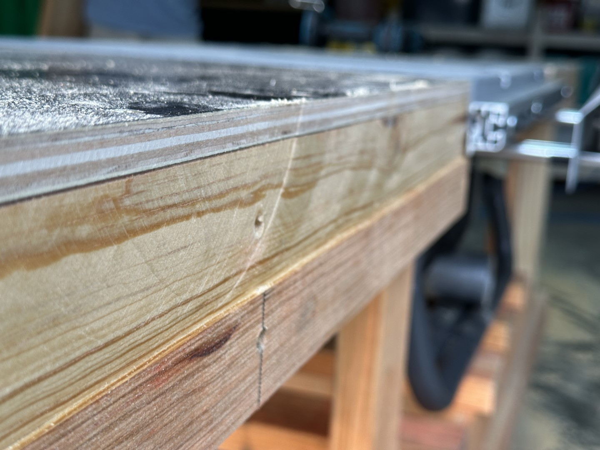

Thankfully, that small trim was all we needed. Upon lowering the table saw back into the bench for the third and final time, we tested the fence in both directions and it was *perfect.* After a bit of tidying up, movement tests, and final checks, we could declare the bench **complete.**

# The finished bench

Well, “almost finished” might be better. The saw still has to be properly secured to the four supports beneath it, and those supports still have to be secured to the workbench. I also discovered that the benchtop has some high spots on the right side of the saw, which means that I’ll have to shim the supports under the back right corner of the saw. At the time of writing, we’ve only just started on fixing the saw position. Still, the bench is mostly done, and it’s the start of a good woodshop. I’m very keen to build the first project with it.

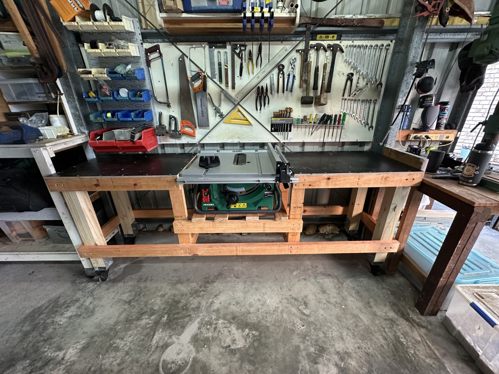