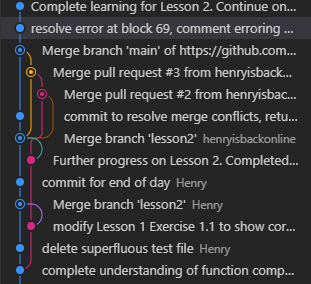
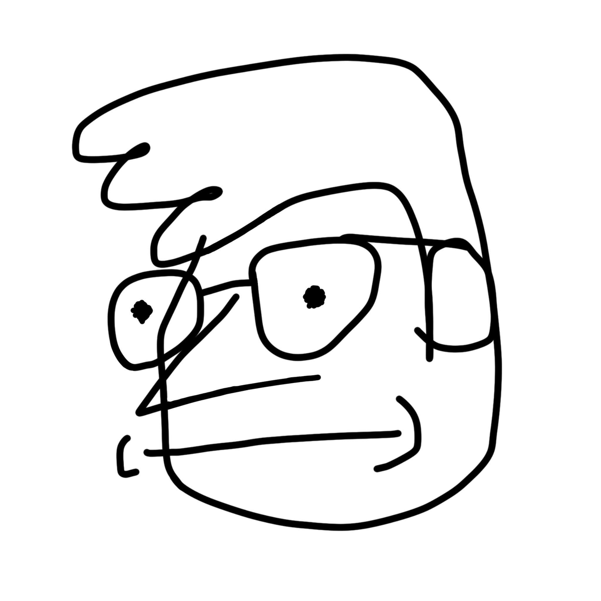
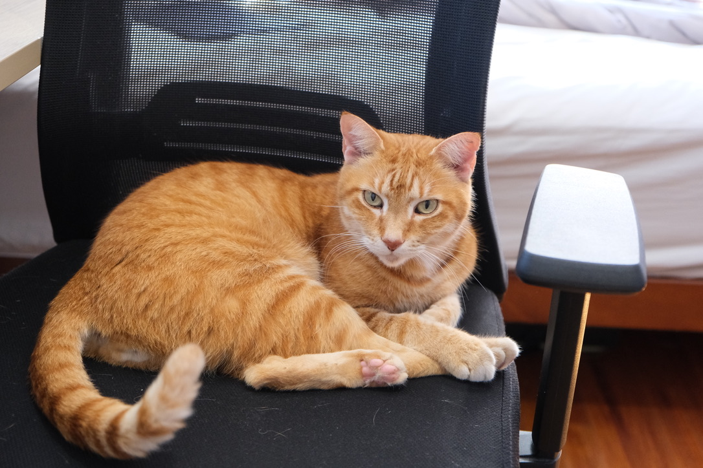

I’m experimenting with GitHub, and so far it’s going _fine_. Not great really, or bad either. Just _fine_. That’s the nature of learning and experimenting I suppose.


I had vscode, terminal, and github open all at once, and tried to do things with all of them. Don’t do this if you treasure your files.

I cherry picked the hairiest and weirdest bit of my git history specifically because I think it's funny. I made a lot of mistakes here. Whoops.

I also made a new face for my face. This image has become important to me, if only because it’s funny and I like it.


Got a new job too, and it’s going well. I’ll have to update my now page, which I’d link here except that Pika’s editor is a bit cumbersome on mobile. As far as creating a post goes though, it’s really easy to use this platform. I think I need to draft my posts in here instead of anywhere else.

> I like it here. It feels peaceful.


Cat. But you knew that already.

## How does this thing work again?

This, beyond anything, is an experiment. Not only an experiment about using this website and if I like it, but if I like blogging and writing in general.

I think I do. I like writing, and I think as far as writing goes, this is the best place to share it socially.  I’m pretty tired of microblogging on social media, and I want a space where my stuff lives. 

A blog sounds good and practical, especially since I want to write more than I want to post photos or videos. Maybe a static site generator like [Eleventy](https://www.11ty.dev/) might be better. Maybe. Anyway.

```
Wonderful monospaced font. 
Running a website seems hard, and I'd much rather someone else do it.
```

The biggest thing that I need is to reduce the friction between myself and writing. Putting words on the page is the goal. A website and its inner workings can come later, for now I just need to write more. Maybe I’ll do one of those “write something once a week” challenges.

Ah well. lots of solutions to problems that I may not even have. For now though, I’m back.


.     .     .