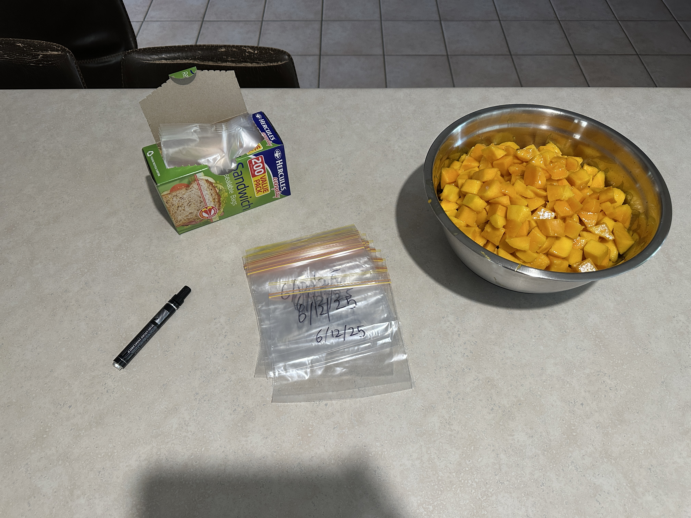
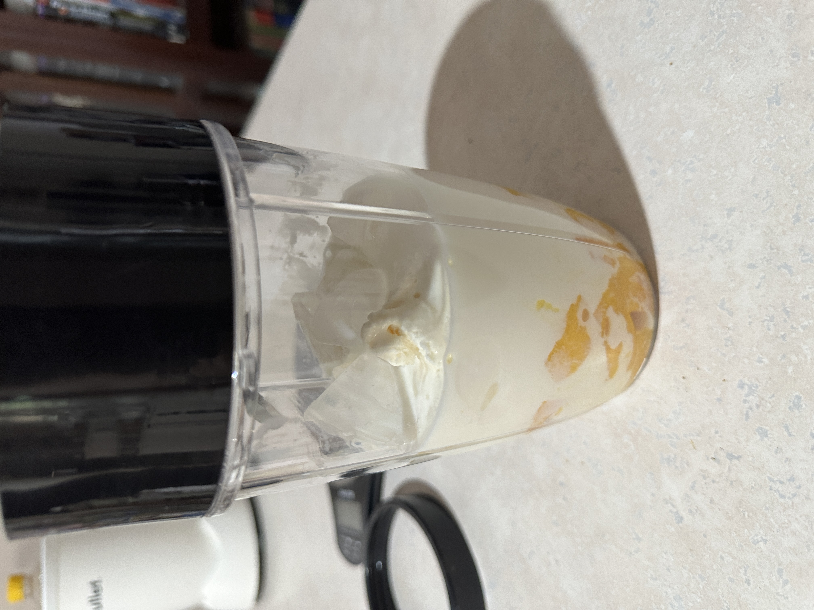
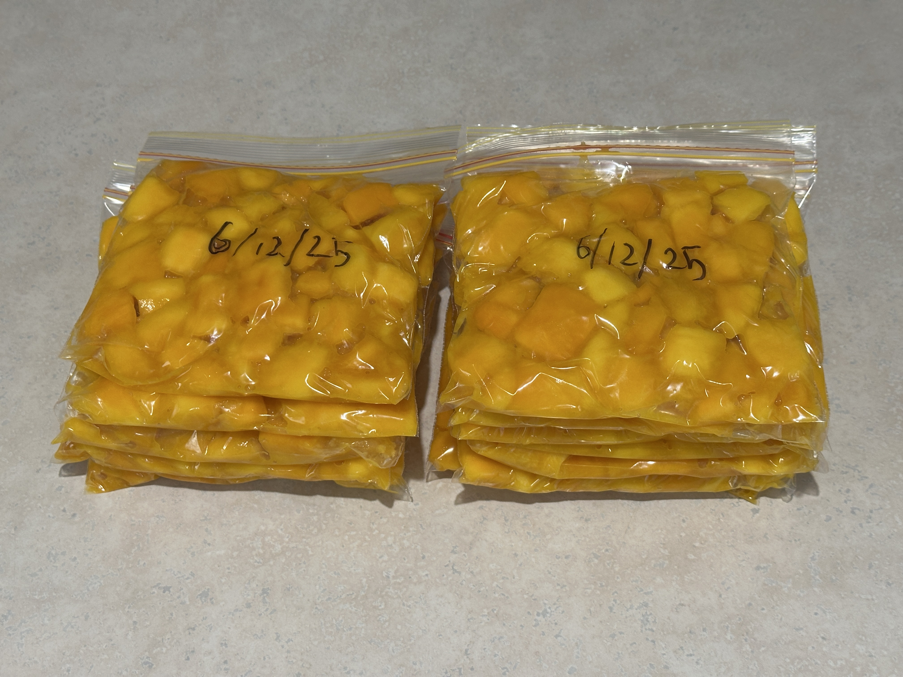

It's December, which means mango season in Queensland. My Dad and I both love mangoes, and fortunately for us, we were gifted with two huge piles of mangoes from work colleagues. After letting them ripen for a bit, we started the mango processing production line that we do every year:

We start with the box of mangoes to one side. Dad cut the off the mango cheeks and removed the flesh from the cheek skin and around the seed, then gave them to me to chop into small cubes. After chopping, I dump them in a big bucket off to the side.

*There were a few rotten ones in there – we left them to ripen just a little too long.*

We managed to fill the entire steel bowl with cubed mango pieces. We decided to store them in ziplock bags in the freezer, so while Dad took the mango husks to the compost (and the chickens, who also love mango season), I took a sharpie and wrote the date on the bags.

However, we needed to figure out how much mango was to go into these bags. The most common use for mango in this house is to make mango smoothies, so we made one with the amount of mango we wanted and decided to fill the bags with the same amount.

Smoothie ingredients:
- 1 serve mangoes (~160g, or one large scoop with a serving spoon)
- 2 scoops vanilla ice cream
- 6ish ice cubes
- Milk to cover it all

It turned out great! The smoothie recipe makes enough for two people, so we had a glass each before bagging the rest of the mangoes.

Using the same blue scoop in the image above, I scooped the mango pieces into the bags while my Dad held them open. After bagging, we ended up with **14** serves of mangoes.

Straight into the freezer they go.

