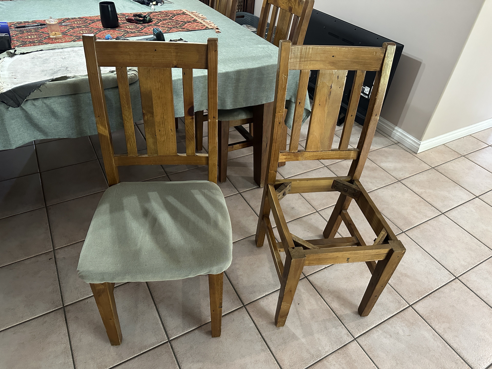
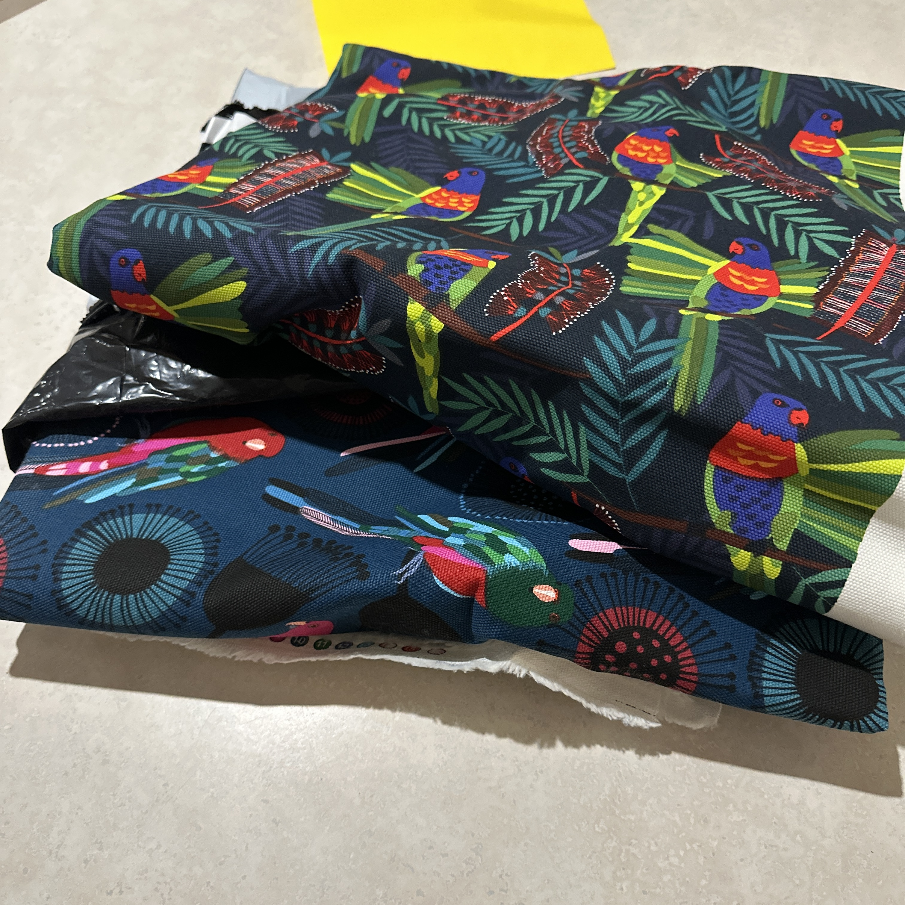
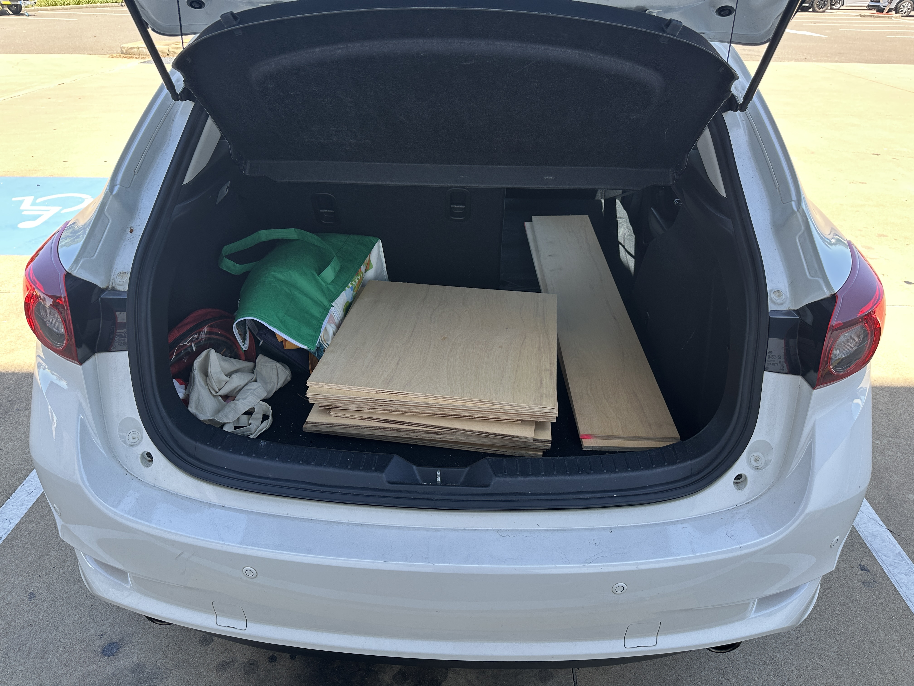
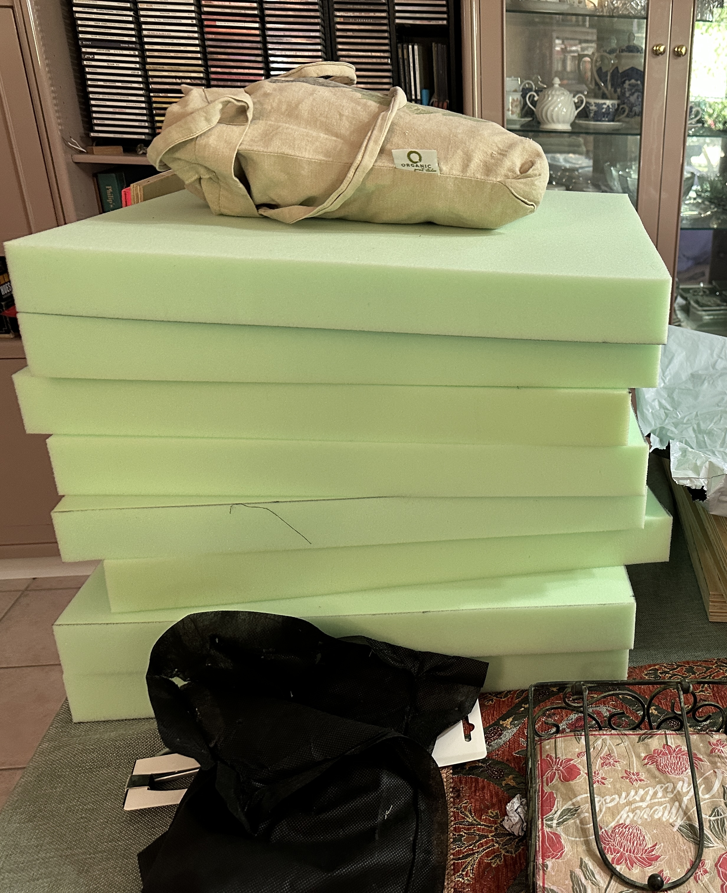
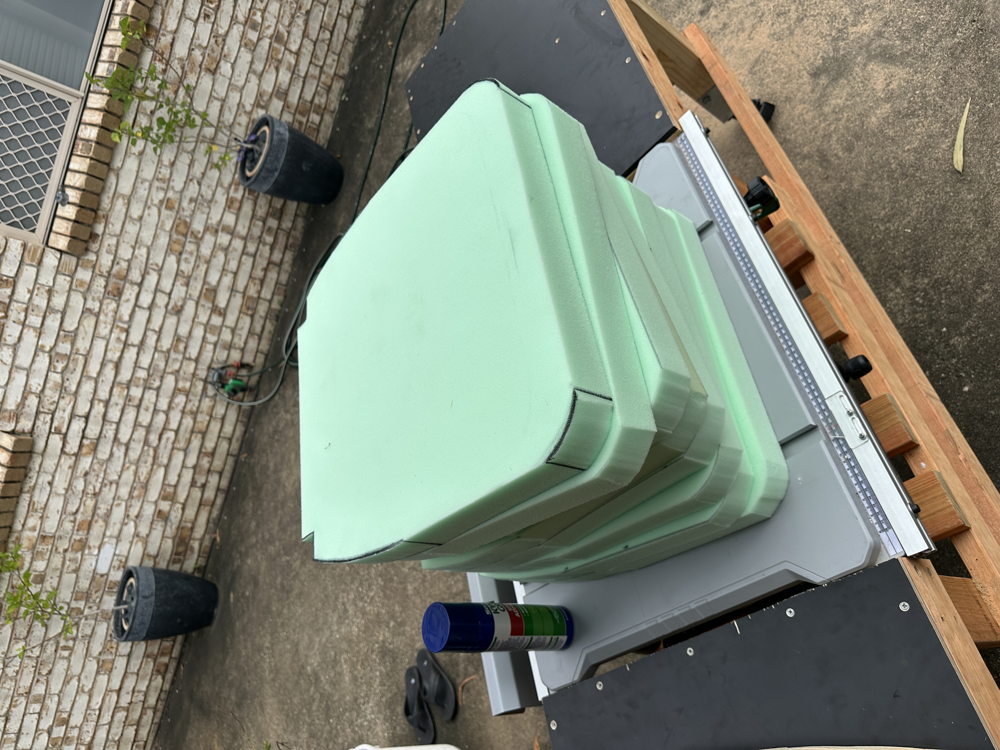
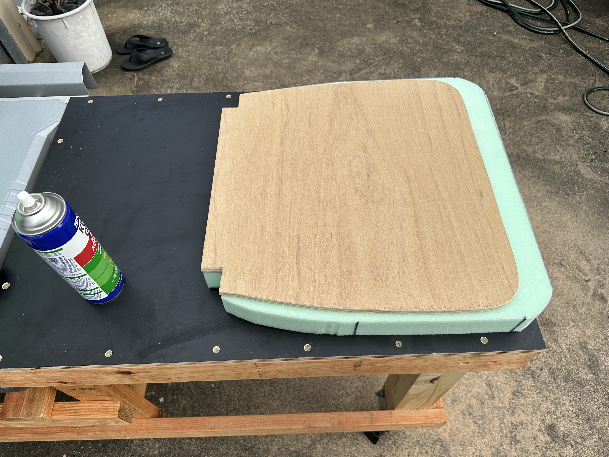

The chairs that go with the dining table at my house are old. We’ve had them for over a decade, and the fabric and foam filling were both pretty degraded. They looked worn and a bit rough, and needed some work done to help them look their best. Thankfully, the timber frame of the chairs were fine, it was just the cushions that needed replacing.

# Measuring the cushions

To replace the cushions, the first step was to remove them from the chairs. This was quite easy - they were attached with a screw in each corner. 

The old fully assembled chair compared to the same chair with the cushion removed

After this, I had to disassemble the cushions themselves. They had quite a few layers:
- The top layer, the one that you sit on
- An underlayer for the top fabric
- The foam cushion
- The plywood base - this was 5mm ply, and it had delaminated over time. This needed replacing, which made the job a little more complicated
- An underlayer for the base of the chair
- A black fabric finish layer for the underside of the cushion

The layers of the cushion - black finish layer not pictured. 

From these layers, I was able to determine the dimensions for all the materials I’d need. 
- 500x500m plywood - preferably thicker material
- 500x500mm high density foam - something about 50mm thick
- 500x500mm squares of white and black fabric
	- white for the lower underlayer, black for the finish layer
- 740x740mm upper underlayer fabric
- My mum had already chosen the fabric she wanted for the top, so I used that. 

# Getting the materials

I bought the fabric that I needed from Spotlight. While they didn’t have the exact fabric I was looking for, I found something better. Plain white and black poplin was the cheapest fabric they had there, and was perfect for this upholstery project. It was a higher thread count and overall a more sturdy material than the upholstery fabrics I pulled out of the cushions on the first place.

Fabric cut to size and laid out on the dining table

After the fabrics, I had to get the new timber for the base. My main concern when searching for the timber was its stability - I wanted something that could easily withstand another 10 years of use and would be resilient against the dramatic temperature and humidity changes that we can experience in North Queensland. I ended up finding 1200×2400mm size 12mm thick marine-grade plywood with a thin oak veneer, which was perfect for my needs.

Despite [building a workbench a little while ago](https://henryisonline.pika.page/posts/building-a-workbench), I couldn’t use that to cut the plywood down to size for two reasons:

1. The saw wasn’t fixed to the bench at the time I was constricting the new cushions (though this has been done at the time of writing), and
2. The plywood wouldn’t fit in my car.

Fortunately, Bunnings offers a panel saw cutting service, and I asked them to cut the plywood down into eight 500x500mm squares and let me keep the offcuts. This made it much easier to transport.

The cut plywood in the back of my car.

The foam was a bit more of a challenge, in that I had *no clue* what the original foam was or what thickness it used to be. I found some upholstery foam typically used for caravans and camper vans, which seemed like it might be pretty resilient and sturdy. I got that foam cut to the same 500x500mm squares as the plywood base, but eventually I had to get them trimmed to shape. 

The foam squares on my dining table.

# Building the cushions

1. I used the shape of the old plywood base as a template and traced the shape onto the new plywood squares, and cut those shapes out with a jigsaw. I also got the foam trimmed to the same shape because it was was an *absolute pain* to do at home.

The foam wasn’t *exactly* the same shape because there had to be some overhang on the front of the chair the I could pull down over the front of the cushion to provide padding for people’s legs.

2. I then glued the foam to the plywood with spray adhesive, making sure to align the back edge of the foam to the back edge of the plywood.

3. After leaving the cushions to dry overnight, I stapled the first underlayer on. This was the underlayer for the top, and was the one that would provide the most tension on the foam.
	- Unfortunately, I cut the fabric slightly too small here. I probably could have done with an extra 20mm on each side, but I made it work. The tension of the foam was higher this way anyway, so probably a good thing ultimately.

4. After this I stapled on the lower underlayer. This went on much more easily, as its main job was to be a padding layer for the black finish layer. I had to stretch it to get a bit of tension (again, probably could have cut the fabric larger), but it went on well.
	- *Note: everyone should buy an Arrow T-50 staple gun*

5. I installed the top layer for the cushion after that, and completely forgot to take any photos of it. This was the fabric that my mum bought, and it looked beautiful.

6. Finally, I attached the black finish layer on the underside of the cushion. Again, I forgot to take any photos, so you’ll have to use your imagination here. It looked the same as the white underlayer from above, only black and a slightly thicker fabric.

# Finishing the chairs

After doing the process above *seven more times*, the cushions were finished. I attached them to the chair frames in the same way I took them off – four screws, one in each corner. I was able to use slightly longer screws for a more secure fit thanks to the thicker plywood I used for the base. 

Compared to the older worn-out fabric, I think these look great. They’re also much more comfortable thanks to the thicker foam cushion.

